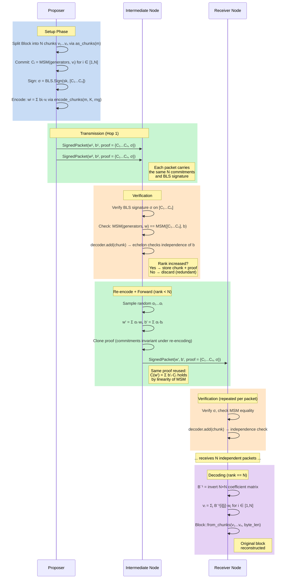
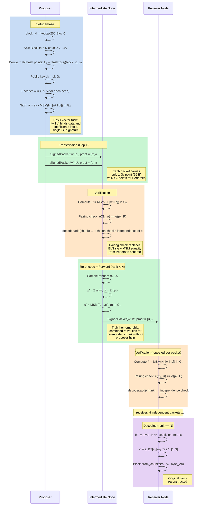

# RLNC Block Propagation — Project Instructions

## Purpose

Compare bandwidth and compute costs of three block-propagation strategies in
isolated peer-to-peer networks:

| Crate            | Strategy                                  | Description                                                                 |
|:-----------------|:------------------------------------------|:----------------------------------------------------------------------------|
| `p2p-pedersen`   | RLNC + Pedersen Commitments                | Nodes send coded chunks verified with **Pedersen commitments** (N per pkt). |
| `p2p-bfkw`       | RLNC + BFKW Signatures                    | Nodes send coded chunks verified with a **single BFKW signature** per pkt.  |

The measurable outputs are per-node and network-wide **bandwidth** and
**compute** under each strategy.

## Key References

- Presentation & math: `docs/book.md` (this repo)
- RLNC proposal: <https://ethresear.ch/t/faster-block-blob-propagation-in-ethereum/21370>
- LHSS proposal: <https://ethresear.ch/t/linearly-homomorphic-signatures-for-rlnc/24072>
- BFKW paper: <https://eprint.iacr.org/2008/316>
- Reference PoC (Pedersen-only, Ristretto255): <https://github.com/potuz/rlnc_poc>

## Workspace Layout

```
crates/
├── primitives/
│   ├── math/         # p2p-primitives-math  — field-generic linear algebra + echelon
│   └── types/        # p2p-primitives-types — Block, Chunk, CodedChunk, BlockDecoder
├── strategy/
│   ├── core/         # p2p-strategy-core    — Strategy trait, ForwardCondition, IntegrityScheme
│   ├── baseline/     # p2p-baseline         — full-block transmission
│   ├── pedersen/     # p2p-pedersen         — RLNC + Pedersen commitments
│   └── bfkw/         # p2p-bfkw            — RLNC + BFKW linearly-homomorphic signatures
├── sim/              # p2p-sim              — discrete-event simulation engine + compare binary
├── node/             # p2p-node             — live p2p node binary (commonware-p2p networking)
└── deploy/           # p2p-deploy           — config generation for local + Docker deployments
```

Rust edition **2024**, MSRV **1.93**. Formatting: `rustfmt.toml` (100-char
lines). Linting: workspace `clippy.toml` with pedantic + nursery.

## Generic Parameters

- **`N` (const generic)**: number of original chunks per block. Fixed at
  compile time (currently `const N: usize = 10` in the compare binary).
- **`m` (runtime)**: chunk dimension (number of field elements per chunk).
  Computed from block size: `m = ceil((block_size + 100) / (31 * N))`. Passed
  as a `usize` parameter — not a const generic.

## Forwarding Conditions

The simulation engine supports three forwarding modes via `ForwardCondition`:

| Variant       | Used by    | Behavior                                                   |
|:--------------|:-----------|:-----------------------------------------------------------|
| `AfterDecode` | Baseline   | Forward once after the full block is decoded (gossipsub).   |
| `OneShot`     | —          | Forward once on first useful receive, then stop.            |
| `UntilDecode` | Pedersen, BFKW | Forward on every rank increase until decode-complete.   |

## Architecture & Execution Flow

### Core Abstractions

The system is built around two key traits in `p2p-strategy-core`:

**`Strategy`** (`strategy/core/src/lib.rs`) is the top-level abstraction
over propagation strategies. Each strategy provides:

- `type NodeState` — per-node mutable state (decoder, accumulated proofs)
- `type Packet: Clone` — wire-level packet transmitted between peers
- `name()` — human-readable strategy name
- `forward_condition()` — returns when to forward (`ForwardCondition`)
- `init_proposer(block, num_peers, rng)` — splits a block into packets
  and returns `(NodeState, Vec<Packet>, byte_len)`
- `init_receiver()` — creates an empty receiver state
- `receive(state, packet)` — processes a packet: `Ok(true)` = new info
  (rank increase), `Ok(false)` = redundant, `Err` = verification failure
- `forward(state, num_peers, rng)` — re-encodes and produces packets
  for mesh neighbors
- `packet_size(packet)` — wire size in bytes (for bandwidth accounting)
- `can_decode(state)` / `decode(state, byte_len)` — check and perform
  block reconstruction

**`IntegrityScheme<F, N>`** (`strategy/core/src/proof.rs`) abstracts the
cryptographic proof that travels with each coded chunk:

- `type Proof` — the integrity proof (Pedersen: N commitments + BLS sig;
  BFKW: single G2 point)
- `type Context` — per-block verification context (public key,
  generators or hash points; no secrets)
- `type Error` — verification error type
- `verify(ctx, chunk, proof)` — verifies a coded chunk against its proof
- `combine(proofs, alphas)` — derives a proof for a re-encoded chunk
  from existing proofs and the combining coefficients

**`IntegrityProof`** (`strategy/core/src/proof.rs`) is a companion trait
for wire serialization of proofs:

- `serialize_proof(buf)` / `deserialize_proof(buf)` — binary encoding
- `proof_wire_size()` — serialized size in bytes

Implemented by each concrete proof type. Enables `SignedPacket` to
provide unified serialization/deserialization.

**`SignedPacket<F, N, S>`** (`strategy/core/src/proof.rs`) is the wire
wrapper that bundles a `CodedChunk` with its `S::Proof`.

**`BlockDecoder<F, N>`** (`primitives/types/src/coding.rs`) tracks
received coded chunks and their coefficient vectors:

- `add(coded_chunk)` — feeds a coded chunk's coefficient vector `b` to
  an `IncrementalEchelon` which checks linear independence. Returns
  `true` if rank increased (chunk stored), `false` if redundant.
- `rank()` / `is_complete()` — current rank and whether rank == N.
- `reencode_with(alphas)` — produces a new coded chunk as a given
  linear combination of stored chunks (for forwarding).
- `reencode(rng)` — convenience wrapper that samples random alphas
  internally.
- `decode()` — once `rank == N`, inverts the coefficient matrix and
  recovers the N original chunks.
- `reset()` — clears state for the next block.

**Helper functions** (`strategy/core/src/helpers.rs`) compose these
traits into reusable receive/forward logic shared by both Pedersen and
BFKW strategies:

- `coded_receive(decoder, proofs, ctx, packet)` — calls
  `IntegrityScheme::verify`, then `decoder.add`, accumulates proof
- `coded_forward(decoder, proofs, num_peers, rng)` — for each peer:
  sample random `alphas`, call `decoder.reencode_with(alphas)`,
  call `IntegrityScheme::combine(proofs, alphas)`, wrap in
  `SignedPacket`

### Simulation Event Loop

The discrete-event engine (`sim/src/engine.rs`) drives block propagation
over a random mesh topology. The `PropagationMechanism<S>` wrapper
(`sim/src/strategy.rs`) binds a `Strategy` with network parameters
(num_nodes, mesh_degree, hop_latency, bandwidth).

```
1. BUILD TOPOLOGY
   Random mesh: n nodes, degree d

2. PROPOSER INIT (node 0)
   strategy.init_proposer(block, d, rng)
     → (state, packets, byte_len)
   Schedule one packet per mesh peer at time = transmission_delay

3. EVENT LOOP
   while event_queue not empty:
     pop (time, to_node, packet)
     skip if node already decoded

     result = strategy.receive(state, packet)
       Ok(true)  → rank increase (useful)
       Ok(false) → redundant
       Err(e)    → verification failed, skip

     check forwarding condition:
       AfterDecode:  can_decode && not yet decoded
       OneShot:      result == Ok(true) && not yet forwarded
       UntilDecode:  result == Ok(true) && !can_decode

     if should_forward:
       packets = strategy.forward(state, neighbors.len(), rng)
       schedule each packet to mesh neighbors

     if can_decode && not yet decoded:
       record decode_time[node] = event.time

4. COLLECT METRICS
   Per-node upload/download, decode times, propagation percentiles,
   redundancy ratio, packet counts
```

### Pedersen Scheme — Block Lifecycle



### BFKW Scheme — Block Lifecycle



### Pedersen vs BFKW Comparison

| Aspect | Pedersen | BFKW |
|:-------|:---------|:-----|
| **Proof per packet** | N commitments (G1) + 1 BLS sig | 1 G2 signature (96 bytes) |
| **Per-packet overhead** | 64N + 96 bytes | 32N + 96 bytes |
| **Verification** | BLS sig check + MSM equality | Pairing check: e(G1,σ) == e(pk,P) |
| **Proof combination** | Clone (commitments invariant) | MSM of σ values (truly homomorphic) |
| **Compute cost** | 2 MSMs in G1 (fast) | 1 MSM in G2 + 2 pairings (slower) |
| **Bandwidth cost** | Higher (N extra G1 points/pkt) | Lower (single G2 point/pkt) |
| **Trade-off** | Less compute, more bandwidth | More compute, less bandwidth |

## Dependency Map

### Commonware (from git `main` branch)

| Crate                    | Role                                                       |
|:-------------------------|:-----------------------------------------------------------|
| `commonware-codec`       | Serialization (Encode/Decode/FixedSize traits)              |
| `commonware-cryptography`| BLS12-381 via `blst`: key types, signatures, hash-to-curve |
| `commonware-math`        | Algebraic traits (Field, Ring, CryptoGroup, HashToGroup)    |
| `commonware-parallel`    | Parallel MSM (Sequential backend)                          |
| `commonware-runtime`     | Async runtime abstraction (used by `p2p-node`)              |
| `commonware-p2p`         | P2P networking layer (used by `p2p-node`)                   |

### General dependencies

| Crate              | Version | Role                                      |
|:-------------------|:--------|:------------------------------------------|
| `alloy-primitives` | 1.5.7   | B256 for block hashes                      |
| `bytes`            | 1.7.1   | Byte buffer utilities                      |
| `clap`             | 4       | CLI argument parsing (node, deploy)        |
| `futures`          | 0.3     | Async combinators (node)                   |
| `prometheus-client` | 0.23   | Metrics exposition (node)                  |
| `rand`             | 0.8     | Randomness (matches commonware's pin)      |
| `rand_chacha`      | 0.3     | Deterministic RNG for reproducible sims    |
| `serde`            | 1       | Serialization for config files             |
| `serde_yaml`       | 0.9     | YAML config parsing (node, deploy)         |
| `tokio`            | 1       | Async runtime (matches commonware's pin)   |
| `tracing`          | 0.1.41  | Structured logging (matches commonware)    |
| `tracing-subscriber` | 0.3  | Log subscriber with env-filter + ANSI      |
| `dotenvy`          | 0.15    | `.env` file loading for sim config         |

Note: commonware does **not** re-export `rand`, `tracing`, etc. They must be
added as direct dependencies.

## Curve Choice: BLS12-381 Everywhere

All cryptographic operations use **BLS12-381** via `commonware-cryptography`
(which wraps `blst` internally):

- **Scalar field**: `commonware_cryptography::bls12381::primitives::group::Scalar`
  (re-exported as `p2p_primitives_math::Scalar`)
- **G1 points**: used for Pedersen commitment generators and public keys
- **G2 points**: used for BFKW hash-to-G2 and signatures
- **Pairings**: `e(G1, G2) -> GT` for BFKW verification

### Rationale

- **Algebraic consistency.** BFKW requires pairings (`e: G1 x G2 -> GT`).
  Using G1 for Pedersen commitments keeps one algebraic system across
  `p2p-pedersen` and `p2p-bfkw`, enabling fair comparison and code reuse.
- **Ristretto has no pairing.** If we used Ristretto for Pedersen commitments,
  `p2p-bfkw` would need a completely separate curve.

### Known cost

G1 MSM is **~5x slower** than Ristretto MSM at comparable sizes. This is
acceptable because per-hop p2p latency (~70 ms) dominates over commitment
compute (~2 ms).

## Pedersen Commitments (p2p-pedersen)

Uses `commonware-math`'s `CryptoGroup::msm` (via `commonware-parallel`) over
BLS12-381 G1. Generators derived deterministically via `HashToGroup` with DST
`b"RLNC-PEDERSEN-GEN-v1"`.

Each commitment is a single G1 point. Verification checks that the commitment
to a coded chunk equals the linear combination of original commitments:
$C(\mathbf{w}) = \sum_i b_i \cdot C_i$.

## BFKW Construction (p2p-bfkw)

Implements the BFKW scheme (Boneh–Freeman–Katz–Waters) over BLS12-381 using
`commonware-math` traits and `commonware-parallel` for MSM. Hash points
derived via `HashToGroup` with DST `b"RLNC-BFKW-H2G-v1"`.

The "basis vector trick" binds both coded data $\mathbf{w}$ and encoding
coefficients $\mathbf{b}$ into a single G2 signature, making the scheme
linearly homomorphic.

```
Setup:   sk <- Fr,  pk = sk * G1
Sign:    sigma = sk * MSM(H, [w || b])
Combine: sigma' = MSM([sigma_1 ... sigma_L], alpha)
Verify:  e(G1, sigma) == e(pk, MSM(H, [w || b]))
```

## RLNC Protocol (shared via primitives crates)

The RLNC core is factored into two shared crates:

- **`p2p-primitives-math`**: field-generic linear algebra (`linear_combination`,
  `random_coefficients`, `reencode`) and `IncrementalEchelon` for rank tracking
  and matrix inversion.
- **`p2p-primitives-types`**: `Block`, `Chunk`, `CodedChunk`, `BlockDecoder`
  with encode/decode methods.

Both `p2p-pedersen` and `p2p-bfkw` depend on these shared crates. The
`Strategy` trait and `IntegrityScheme` abstraction live in `p2p-strategy-core`.

## Simulation (p2p-sim)

The `compare` binary runs all three strategies over configurable blocks via a
discrete-event simulation engine. Configuration is loaded from `.env` via
`dotenvy` with environment variable overrides (all prefixed `RLNC_`).

Key parameters: `RLNC_NUM_NODES`, `RLNC_BLOCK_SIZE`, `RLNC_NUM_BLOCKS`,
`RLNC_BASELINE_DEGREE`, `RLNC_RLNC_DEGREE`, `RLNC_HOP_LATENCY_MS`,
`RLNC_BANDWIDTH_MBPS`, `RLNC_SEED`.

Logging levels: `RUST_LOG=info` (default) shows config + progress + comparison
table. `debug` adds per-node decode events. `trace` adds full pipeline
visibility (chunk accept/reject, forwarding, re-encoding).

## Local References

Symlinked under `references/` (git-ignored):

| Path                         | Content                                       |
|:-----------------------------|:----------------------------------------------|
| `references/alloy`           | alloy-rs/alloy source (v1.7.3)                |
| `references/alloy-core`      | alloy-rs/core source (alloy-primitives v1.5.7)|
| `references/alloy-examples`  | alloy-rs/examples                             |
| `references/commonware-monorepo` | Commonware monorepo source                |
| `references/commonware-alto` | Commonware Alto reference app                 |

Commonware's MCP server is also available for searching code and docs.

## Coding Conventions

- Follow existing `rustfmt.toml` and `clippy.toml` exactly.
- Max line width: 100 characters.
- Document all public items (`missing_docs = "warn"`).
- No `unsafe` code (`unsafe_code = "deny"`).
- Use `tracing` for instrumentation, not `println!`.
- All finite-field arithmetic uses the BLS12-381 scalar from commonware.
- All elliptic-curve operations use `commonware-math` traits (`CryptoGroup`,
  `HashToGroup`) and `commonware-parallel` for MSM.
- Use additive notation for elliptic-curve groups (matching the presentation).
- Tests should include small-field worked examples alongside full BLS12-381
  tests.
