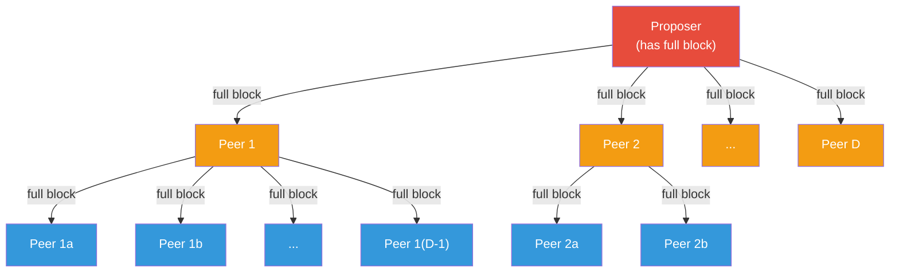
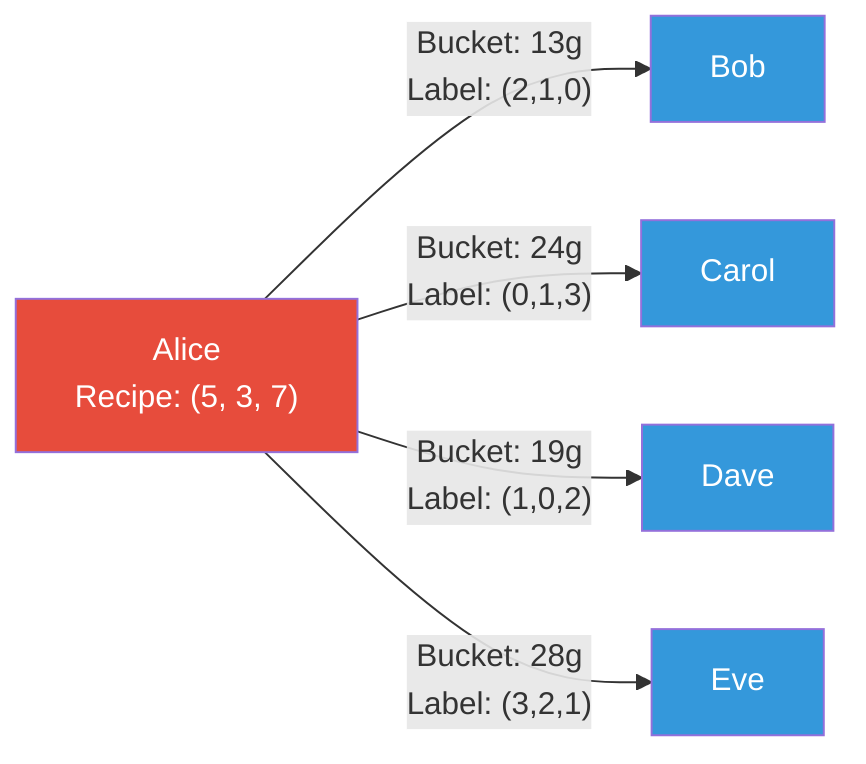
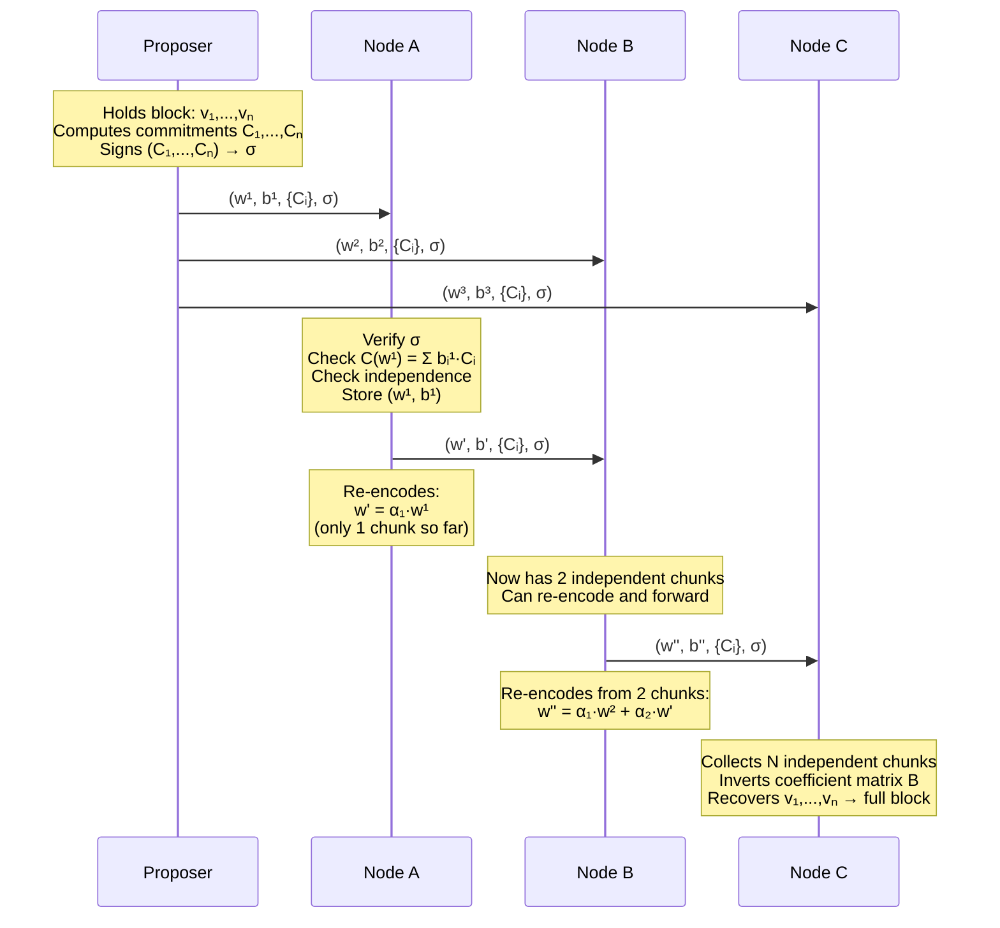
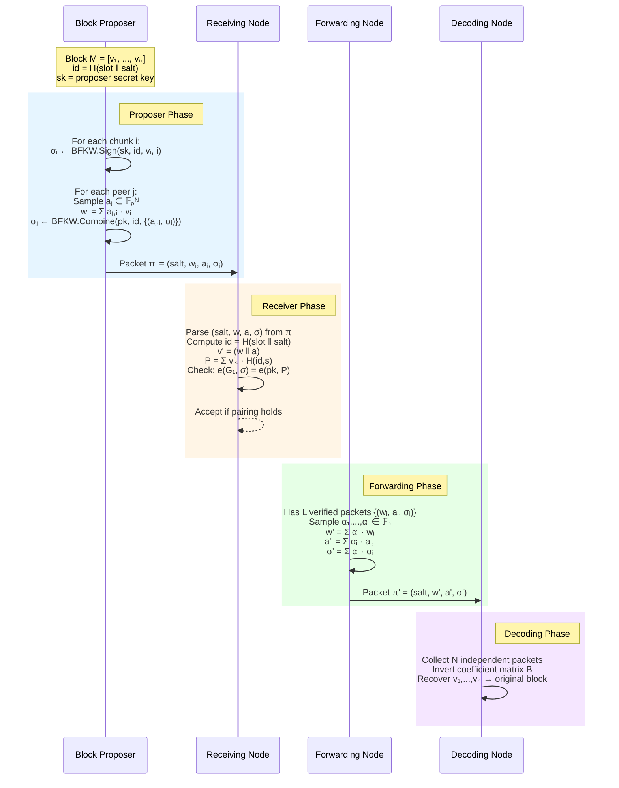

# Linearly-Homomorphic Signatures for Random Linear Network Coding

## A Technical Deep-Dive for Ethereum's Next-Generation Block Propagation

---

## Scope and Structure

This document builds the full conceptual and mathematical foundation for understanding
why Ethereum needs a new block propagation mechanism, how Random Linear Network Coding
(RLNC) solves the problem, and why Linearly-Homomorphic Signatures (LHSS) are the
cryptographic key that makes RLNC practical at scale.

Each chapter begins with an intuitive, jargon-free explanation (ELI5) and progressively
layers in rigorous mathematics. The reader should be able to stop at any depth and still
walk away with a coherent understanding.

---

### Document Outline

```
Part I — The Problem
├── Chapter 1: Ethereum's Scaling Roadmap
│   ├── 1.1  Today: Post-Fusaka Ethereum
│   ├── 1.2  Next: Glamsterdam and Hegota
│   ├── 1.3  The Endgame: zkEVM
│   ├── 1.4  Why This Leads to Bigger Blocks
│   └── 1.5  Gossipsub: How Blocks Travel Today
│
├── Chapter 2: Why Full-Block Propagation Breaks Down
│   ├── 2.1  The Redundancy Tax
│   ├── 2.2  Modeling Propagation Latency
│   └── 2.3  The Scalability Wall
│
Part II — The Solution: Network Coding
├── Chapter 3: Random Linear Network Coding from First Principles
│   ├── 3.1  The Intuition: Mixing Instead of Copying
│   ├── 3.2  Finite Fields: The Arithmetic Foundation
│   ├── 3.3  Vectors, Subspaces, and Linear Combinations
│   ├── 3.4  RLNC Encoding and Decoding
│   ├── 3.5  Verifying Integrity: Pedersen Commitments
│   └── 3.6  The Full RLNC Protocol for Ethereum
│
├── Chapter 4: The Commitment Overhead Problem
│   ├── 4.1  Counting Bytes: What Every Packet Carries
│   ├── 4.2  Why N Commitments per Packet Hurts
│   └── 4.3  What We Really Want: A Single Authenticator
│
Part III — Linearly-Homomorphic Signatures
├── Chapter 5: Homomorphic Signatures from First Principles
│   ├── 5.1  The Intuition: Signatures That Compose
│   ├── 5.2  Bilinear Pairings: The Mathematical Engine
│   ├── 5.3  The LHSS Abstraction (Setup, Sign, Combine, Verify)
│   └── 5.4  Security: What Does "Unforgeable" Mean Here?
│
└── Chapter 6: The BFKW Construction in Practice
    ├── 6.1  The Full Construction: Step by Step
    ├── 6.2  Integrating LHSS into the RLNC Protocol
    ├── 6.3  Performance: Pedersen vs. LHSS
    └── 6.4  Open Questions and Future Directions

Appendices
└── Appendix A: Gaussian Elimination and Matrix Inversion over F_p
    ├── A.1  Row-Echelon Form
    ├── A.2  Gaussian Elimination over F_p
    ├── A.3  Back-Substitution
    ├── A.4  Incremental Echelon Maintenance
    ├── A.5  Full Matrix Inversion
    └── A.6  Reference Implementation (Python)
```

---

### Audience

- **Primary**: Ethereum researchers, consensus-layer engineers, and protocol designers.
- **Secondary**: Cryptography enthusiasts and applied mathematicians interested in
  network coding.

### Conventions

- All mathematical notation uses KaTeX-compatible LaTeX.
- Inline math: `$...$`. Display math: `$$...$$`.
- Vectors are bold lowercase: $\mathbf{v}$, $\mathbf{m}$.
- Matrices are bold uppercase: $\mathbf{M}$, $\mathbf{A}$.
- Groups use blackboard bold: $\mathbb{G}_1$, $\mathbb{G}_2$, $\mathbb{G}_T$.
- Finite fields: $\mathbb{F}_p$.
- Scalars are lowercase italic: $a$, $b$, $\alpha$.
- Hash functions: $H$.
- Pairing: $e : \mathbb{G}_1 \times \mathbb{G}_2 \to \mathbb{G}_T$.
- Protocol steps use imperative mood.
- ELI5 sections use conversational tone; MATH sections use formal academic tone.

---

*Chapters follow below.*

---

# Part I — The Problem

---

## Chapter 1: Ethereum's Scaling Roadmap

Ethereum's rollup-centric roadmap has already delivered. Layer 2 rollups handle the
bulk of user-facing transactions while Ethereum serves as the settlement and
data-availability backbone. The question is no longer *whether* this architecture
works, but whether the base layer can keep pace with the demands being placed on it.
Each successive upgrade makes the network more capable — and each makes the blocks
that validators must propagate larger.

### 1.1 Today: Post-Fusaka Ethereum

The **Fusaka** hard fork activated on Ethereum mainnet on December 3, 2025. It is
the most significant consensus-layer upgrade since Dencun, shipping $12$ EIPs that
collectively reshaped Ethereum's data-availability and execution landscape.

**PeerDAS (EIP-7594)** is the headline feature. It replaces the previous "everyone
downloads everything" model for blob data with **Data Availability Sampling**.
Blob data is erasure-coded using Reed-Solomon encoding and extended into $128$
**columns**. Each regular node subscribes to $8$ randomly chosen column subnets —
receiving only $1/16$ of the extended data ($1/8$ of the original). Supernodes
(validators staking $\geq 4{,}096$ ETH) custody all $128$ columns.

PeerDAS unlocked a $8\times$ theoretical increase in blob capacity. That capacity
is being activated gradually via **Blob-Parameter-Only (BPO)** forks — lightweight
updates that adjust blob parameters without a full hard fork:

| Fork     | Date              | Blob target | Blob max |
|:---------|:------------------|:-----------:|:--------:|
| Fusaka   | Dec 3, 2025       | $6$         | $9$      |
| BPO-1    | Dec 17, 2025      | $10$        | $15$     |
| BPO-2    | Jan 7, 2026       | $14$        | $21$     |

Blob counts continue doubling every few weeks, targeting $48$ blobs per block in
Q1 2026, with $72$ and eventually $128$+ blobs under active discussion.

Fusaka also raised the block gas limit to $60$ million (double the pre-Pectra
level) and introduced a hard **$10$ MiB execution-payload size cap** (EIP-7934).

**Where things stand today (February 2026):** the blob target is $14$, the gas limit
is $60$M, and PeerDAS is live. Each slot produces:

$$
B_{\text{today}} \approx 200 \;\text{KB (execution payload)} + 14 \times 128 \;\text{KB (blobs)} \approx 2 \;\text{MB}
$$

### 1.2 Next: Glamsterdam and Hegota

The Ethereum Foundation has committed to two hard forks in 2026, each pushing
throughput further.

**Glamsterdam (H1 2026)** comprises up to $22$ EIPs. The two headliners are:

- **EIP-7732 — Enshrined Proposer-Builder Separation (ePBS).** Moves the
  proposer-builder separation mechanism on-chain, replacing trusted relay
  infrastructure with a protocol-native auction. ePBS restructures block
  production: builders compete to construct execution payloads, proposers select
  among them. This restructuring widens the window between block production and
  confirmation — a prerequisite for real-time ZK proving.

- **EIP-7928 — Block-Level Access Lists (BALs).** Requires transactions to declare
  storage access patterns, enabling parallel execution of non-conflicting
  transactions. BALs lay the groundwork for pushing L1 throughput toward
  $10{,}000+$ TPS in the long run.

Glamsterdam targets a gas limit of $100$ million. After ePBS lands, projections
from Ethereum Foundation leadership suggest doubling further to $200$ million.

Blob capacity continues scaling in parallel. The target path:
$48 \to 72 \to 128$+ blobs per block.

**Hegota (H2 2026)** focuses on sustainability under this increased throughput:

- **Verkle Trees** replace the Merkle Patricia Trie, reducing state proof sizes and
  keeping solo-staking viable as the gas limit approaches $180$M.
- **FOCIL** (fork-choice enforced inclusion lists) strengthens censorship resistance.
- Post-quantum cryptography groundwork begins.

After Hegota, the projected per-slot data budget is:

$$
B_{\text{post-Hegota}} \approx 500 \;\text{KB (execution payload at 180M gas)} + 72 \times 128 \;\text{KB} \approx 9.7 \;\text{MB}
$$

### 1.3 The Endgame: zkEVM

Beyond 2026, the Ethereum Foundation's **zkEVM initiative** aims to make the
entire execution layer provable in zero knowledge. The vision: every Ethereum block
is accompanied by a succinct ZK proof, shifting the security model from "every
validator re-executes every transaction" ($N$-of-$N$) to "one prover generates a
proof, all validators verify it" ($1$-of-$N$).

The initiative, tracked at [zkevm.ethereum.foundation](https://zkevm.ethereum.foundation),
is organized into three workstreams:

1. **Real-time proving** — generating ZK proofs within the $12$-second slot time.
   Current state: the SP1 Hypercube zkVM proves $93\%$ of recent mainnet blocks in
   real time on a cluster of $200$ GPUs. Two prover implementations (OpenVM and
   RISC0) pass $100\%$ of the Ethereum Foundation test suite. Target: full
   $128$-bit provable security with sub-$300$ KB proofs.

2. **Client integration** — standardizing how execution and consensus clients request,
   generate, and verify proofs. Reth and Ethrex are spec-compliant; Geth,
   Nethermind, and CL clients are in progress.

3. **Beam Chain** — a ground-up redesign of the consensus layer that is
   ZK-optimized from inception, replacing the current Beacon Chain.

zkEVM is not yet on a concrete hard-fork schedule, but the Glamsterdam ePBS changes
are explicitly designed to widen the timing window that real-time proving requires.

The impact on block sizes is twofold. First, zkEVM *enables* aggressive gas-limit
increases: once validators verify a proof instead of re-executing, the execution cost
per validator drops to near zero, removing the primary argument against raising the
gas limit. Second, the proofs themselves add data that must propagate (though at
sub-$300$ KB, this is modest relative to blob data).

### 1.4 Why This Leads to Bigger Blocks

The trajectory is unmistakable. Each upgrade adds data that validators must propagate
within the $12$-second slot:

| Era                         | Gas limit | Blob target | Per-slot data    |
|:----------------------------|:---------:|:-----------:|:----------------:|
| Pre-Fusaka (Pectra)         | $30$M     | $6$         | $\sim 1$ MB      |
| **Today** (post-Fusaka)     | $60$M     | $14$        | $\sim 2$ MB      |
| Post-Glamsterdam (mid-2026) | $100$M    | $48$        | $\sim 6.5$ MB    |
| Post-Hegota (late 2026)     | $180$M    | $72$        | $\sim 10$ MB     |
| Post-zkEVM (future)         | $200$M+   | $128$+      | $\sim 17$+ MB    |

Three forces compound:

1. **More blobs.** Each blob is $\sim 128$ KB. Going from $6$ to $128$ blobs adds
   $\sim 15.6$ MB of raw data per slot.

2. **Higher gas limits.** More gas means larger execution payloads. A $200$M-gas
   block can produce an execution payload several times larger than today's.

3. **zkEVM unlocks further scaling.** By removing the re-execution burden from
   validators, zkEVM removes the primary bottleneck on gas-limit increases,
   enabling even larger blocks.

> **The core tension:** Ethereum is on a path to $10$–$17$+ MB per slot,
> but the peer-to-peer layer that distributes this data was designed for
> blocks an order of magnitude smaller.

### 1.5 Gossipsub: How Blocks Travel Today

Ethereum's consensus layer uses **gossipsub** (specifically gossipsub v1.1 via
libp2p) to propagate blocks across the network.

Every node maintains a **mesh** — a set of $D$ peers to which it has a direct,
full-message connection. The libp2p default is $D = 6$, with an acceptable range of
$4$ to $12$. In practice, Ethereum clients typically operate with $D \approx 8$.

When a block proposer creates a new block, propagation proceeds in rounds:



**Hop 0:** The proposer sends the *entire block* to each of its $D$ mesh peers.

**Hop 1:** Each of those $D$ peers sends the *entire block* to each of *their* $D$
mesh peers.

**Hop $k$:** The process repeats. After $k$ hops, up to $D^k$ nodes have the block.

Two properties define gossipsub's behavior:

1. **Full-block forwarding.** Every hop transmits the complete block. A node cannot
   forward a block until it has received and validated the entire thing.

2. **Redundant delivery.** Mesh connections overlap. A node frequently receives the
   same block from multiple peers. The duplicates are discarded, but the bandwidth
   has already been consumed.

For a network of $n \approx 10{,}000$ validators with $D = 8$, reaching all nodes
requires approximately:

$$
k \approx \frac{\log n}{\log D} = \frac{\log 10{,}000}{\log 8} \approx \frac{4}{0.9} \approx 4.4 \implies 5\text{–}6 \text{ hops}
$$

Each hop incurs both **latency** (network round-trip time) and **bandwidth**
(full block transmission). The total propagation time is:

$$
T_{\text{gossipsub}} = k \cdot \left( L + \frac{B}{X} \right)
$$

where $L$ is the per-hop latency (typically $\sim70$ ms), $B$ is the block size in
bytes, and $X$ is the per-peer bandwidth in bytes per second.

This formula reveals the fundamental problem: **propagation time scales linearly
with block size**. Double the block, double the propagation time at every hop, across
every hop.

---

## Chapter 2: Why Full-Block Propagation Breaks Down

### 2.1 The Redundancy Tax

Imagine a classroom of $30$ students. The teacher has a handout and asks each student
to photocopy it for $8$ of their friends. Each friend then photocopies it for $8$ of
*their* friends. Within a couple of rounds, everyone has a copy — but the copy machine
has run hundreds of times, and most of those copies went to people who already had one.

This is gossipsub. It is designed for reliability, not efficiency. Every node that
receives the block rebroadcasts it to all $D$ mesh peers, regardless of whether those
peers already have it. The total number of block transmissions across the network is:

$$
W_{\text{gossipsub}} = n \cdot D \cdot B
$$

where $n$ is the number of nodes. For $n = 10{,}000$, $D = 8$, and $B = 2$ MB
(today's post-Fusaka slot data):

$$
W_{\text{gossipsub}} = 10{,}000 \times 8 \times 2\;\text{MB} = 160\;\text{GB of total network traffic}
$$

But only $n \times B = 20$ GB of *useful* data was delivered (one copy per node). The
rest — $140$ GB — is pure waste. The **redundancy ratio** is:

$$
R = \frac{W_{\text{gossipsub}}}{n \cdot B} = D = 8
$$

Every byte of block data is transmitted $8\times$ more often than necessary, on average.

### 2.2 Modeling Propagation Latency

Let us formalize the latency model. In gossipsub with mesh degree $D$ and a network
of $n$ nodes arranged as a random graph, the number of hops to reach all nodes is:

$$
k_{\text{gossipsub}} = \left\lceil \frac{\ln n}{\ln D} \right\rceil
$$

The end-to-end propagation time is:

$$
T_{\text{gossipsub}} = k_{\text{gossipsub}} \cdot \left( L + \frac{B}{X} \right)
$$

where:

| Symbol | Meaning                              | Typical value       |
|:------:|:-------------------------------------|:--------------------|
| $L$    | Per-hop network latency              | $70$ ms             |
| $B$    | Block size                           | $2$–$17$ MB         |
| $X$    | Per-peer upload bandwidth            | $20$ MB/s           |
| $D$    | Mesh degree                          | $8$                 |
| $n$    | Network size                         | $10{,}000$          |

For today's post-Fusaka parameters ($B = 2$ MB, $k = 6$):

$$
T_{\text{today}} = 6 \times \left(70 + \frac{2{,}000}{20}\right) = 6 \times 170 = 1{,}020 \;\text{ms}
$$

Comfortable — about one second. But for a post-Hegota scenario ($B = 10$ MB, $k = 6$):

$$
T_{\text{Hegota}} = 6 \times \left(70 + \frac{10{,}000}{20}\right) = 6 \times 570 = 3{,}420 \;\text{ms}
$$

That is $3.4$ seconds — consuming nearly the entire $4$-second propagation budget.
And for the post-zkEVM horizon ($B = 17$ MB):

$$
T_{\text{zkEVM}} = 6 \times \left(70 + \frac{17{,}000}{20}\right) = 6 \times 920 = 5{,}520 \;\text{ms}
$$

$5.5$ seconds — **exceeding the slot budget entirely**. And all of these assume ideal
conditions: no packet loss, no congestion, no slow peers.

### 2.3 The Scalability Wall

The problem is structural, not incidental. Gossipsub has two properties that become
liabilities as blocks grow:

**Property 1: Atomic forwarding.** A node cannot forward anything until it has
received and validated the *entire* block. This creates a strict sequential
dependency at every hop: receive-all, validate, then send-all.

**Property 2: Full duplication.** Every hop transmits the complete block to every
mesh peer. There is no mechanism to send "just the part you're missing."

Together, these properties create a **scalability wall**: a block size beyond which
the network cannot propagate blocks within the slot's time budget.

$$
B_{\text{max}} = \frac{T_{\text{budget}}}{k} \cdot X - L \cdot X
$$

For $T_{\text{budget}} = 4{,}000$ ms, $k = 6$, $X = 20$ MB/s, $L = 70$ ms:

$$
B_{\text{max}} = \frac{4{,}000}{6} \times 20 - 70 \times 20 \approx 13{,}333 - 1{,}400 = 11{,}933 \;\text{KB} \approx 11.7 \;\text{MB}
$$

This looks like headroom — until you account for real-world degradation. With
packet loss, variable peer quality, and validation overhead, the practical limit
is roughly half the theoretical maximum: around $5$–$6$ MB. Ethereum's scaling
roadmap pushes to $10$ MB by late 2026 and $17$+ MB in the zkEVM era — well past
this wall.

> **The conclusion is clear:** Gossipsub's full-block-per-hop design cannot
> sustain the block sizes that Ethereum's scalability roadmap demands. A
> fundamentally different approach is needed — one that breaks blocks into pieces,
> eliminates redundancy, and lets nodes begin forwarding before they have the
> complete data.
>
> That approach is **Random Linear Network Coding**.

---

# Part II — The Solution: Network Coding

---

## Chapter 3: Random Linear Network Coding from First Principles

### 3.1 The Intuition: Mixing Instead of Copying

Forget cryptography for a moment. Think about paint.

**Alice** is an artist. She has invented a signature color by mixing three base
pigments in a precise recipe:

- $5$ grams of **Red**
- $3$ grams of **Green**
- $7$ grams of **Blue**

These three numbers — $(5, 3, 7)$ — *are* the recipe. Alice wants every painter in
her studio network (**Bob**, **Carol**, **Dave**, and **Eve**) to learn this recipe
so they can reproduce her color exactly.

#### The naive approach (gossipsub)

Alice prepares three buckets, one per pigment:

- Bucket 1 contains $5$g of pure Red
- Bucket 2 contains $3$g of pure Green
- Bucket 3 contains $7$g of pure Blue

She hands all three buckets to Bob, who copies them and hands copies to Carol, and
so on down the chain. Two problems: (1) everyone must wait for *all three* buckets
before passing anything along, and (2) if Bucket 2 is lost in transit, nobody
downstream ever learns the Green amount — the recipe is incomplete.

#### The network coding approach

Instead of sending pure pigments, Alice sends **mixtures**. Each mixture is a single
bucket that blends all three pigments in known ratios, and comes with a **label**
listing those ratios. She prepares four buckets — one more than the three unknowns,
for redundancy:

| Bucket | Label (ratios)         | Contents (grams)                             |
|:------:|:-----------------------|:---------------------------------------------|
| To Bob | $(2, 1, 0)$            | $2 \times 5 + 1 \times 3 + 0 \times 7 = 13$ |
| To Carol | $(0, 1, 3)$          | $0 \times 5 + 1 \times 3 + 3 \times 7 = 24$ |
| To Dave | $(1, 0, 2)$           | $1 \times 5 + 0 \times 3 + 2 \times 7 = 19$ |
| To Eve | $(3, 2, 1)$            | $3 \times 5 + 2 \times 3 + 1 \times 7 = 28$ |

Each bucket holds a single number (the weighted sum) plus a label (the weights
used). Nobody receives a pure pigment — every bucket is a blend.



#### Why are the labels "independent"?

The label on each bucket is a vector of ratios. Three labels are **linearly
independent** when no label can be recreated by scaling and adding the other two.
For example, Bob's label $(2, 1, 0)$ cannot be produced from any combination of
Carol's $(0, 1, 3)$ and Dave's $(1, 0, 2)$ — no matter what multipliers you try, you
cannot zero out the first component while matching the other two. This means the
three equations they define each carry genuinely new information about the unknowns.

If two labels *were* dependent — say Eve had label $(2, 2, 3)$, which equals Bob's
$(2,1,0)$ plus Carol's $(0,1,3)$ — then Eve's bucket (37g) would just be the sum of
Bob's (13g) and Carol's (24g). Her equation would be redundant, adding no new
information toward solving for the unknowns.

#### Recovering the recipe: a worked example

Suppose Dave's bucket spills. Alice's recipe is lost in transit. But Bob, Carol, and
Eve still have their buckets. Their labels give three equations in three unknowns
($R$, $G$, $B$):

$$
\begin{aligned}
2R + 1G + 0B &= 13 \quad \text{(Bob)} \\
0R + 1G + 3B &= 24 \quad \text{(Carol)} \\
3R + 2G + 1B &= 28 \quad \text{(Eve)}
\end{aligned}
$$

Solving step by step:

- From Bob's equation: $G = 13 - 2R$.
- Substitute into Carol's: $13 - 2R + 3B = 24 \implies 3B = 11 + 2R$.
- Substitute both into Eve's: $3R + 2(13 - 2R) + \frac{11 + 2R}{3} = 28$.
- Simplifying: $3R + 26 - 4R + \frac{11 + 2R}{3} = 28$, which gives $R = 5$.
- Back-substitute: $G = 13 - 10 = 3$, then $B = \frac{11 + 10}{3} = 7$.

**Result:** $(R, G, B) = (5, 3, 7)$ — the recipe is fully recovered, despite
losing Dave's bucket. Any three of the four buckets with independent labels would
work equally well.

#### Anyone can remix and forward

Bob does not need Alice's original pigments. Suppose Bob receives his own bucket
(13g, label $(2,1,0)$) and later also receives Carol's bucket (24g, label $(0,1,3)$).
He can create a brand-new mixture by combining them — say, $1 \times$ his bucket $+$
$1 \times$ Carol's:

- New contents: $13 + 24 = 37$ grams
- New label: $(2+0,\; 1+1,\; 0+3) = (2, 2, 3)$

This new bucket is a valid linear combination of Alice's original recipe that Bob
can forward to anyone. The recipient can use it alongside any two other independent
buckets to recover the recipe. **No one except Alice ever needs the pure pigments.**

#### The mapping to RLNC

| Paint analogy          | RLNC                                              |
|:-----------------------|:--------------------------------------------------|
| Alice's recipe $(5,3,7)$ | The block, split into $N$ chunks             |
| A base pigment (Red)   | One chunk $\mathbf{v}_i$                          |
| A bucket's contents    | A coded chunk $\mathbf{w} = \sum b_i \mathbf{v}_i$|
| A bucket's label       | The coefficient vector $\mathbf{b}$               |
| Solving the equations  | Gaussian elimination over a finite field          |
| $3$ unknowns, need $3$ independent equations | $N$ chunks, need $N$ independent coded chunks |

### 3.2 Finite Fields: The Arithmetic Foundation

To perform RLNC, we need an arithmetic system where addition, subtraction,
multiplication, and division all work cleanly — with no rounding errors, no overflow,
and no information loss. That system is a **finite field**.

> **ELI5:** A finite field is like a clock. On a 12-hour clock, $10 + 5 = 3$ (because
> $15 \mod 12 = 3$). Every "number" on the clock has an addition partner that brings
> you back to $12$ (i.e., $0$), and every nonzero number has a multiplication partner
> that brings you to $1$. This means you can add, subtract, multiply, and
> divide — and you never leave the clock.

Formally, a **finite field** $\mathbb{F}_p$ (where $p$ is a prime) is the set
$\{0, 1, 2, \ldots, p-1\}$ equipped with two operations:

- **Addition**: $a + b \pmod{p}$
- **Multiplication**: $a \cdot b \pmod{p}$

These satisfy the standard field axioms: commutativity, associativity, distributivity,
and the existence of additive and multiplicative inverses for every nonzero element.

**Why do we need a finite field for RLNC?**

1. **Exact arithmetic.** Mixing and unmixing data requires operations that are perfectly
   reversible. Floating-point arithmetic introduces rounding errors; finite-field
   arithmetic does not.

2. **Bounded representation.** Every element of $\mathbb{F}_p$ fits in
   $\lceil \log_2 p \rceil$ bits. There is no coefficient blowup as we compose
   linear combinations.

3. **Division is always possible.** Every nonzero element $a \in \mathbb{F}_p$ has a
   multiplicative inverse $a^{-1}$ such that $a \cdot a^{-1} \equiv 1 \pmod{p}$.
   This is essential for decoding (solving linear systems).

**The field used in practice.** The RLNC proposal for Ethereum uses the **Ristretto
scalar field** — the scalar field of the Ristretto255 group built atop Curve25519.
This is a prime field $\mathbb{F}_p$ where:

$$
p = 2^{252} + 27742317777372353535851937790883648493
$$

Each field element occupies exactly $32$ bytes.

### 3.3 Vectors, Subspaces, and Linear Combinations

With a finite field in hand, we can represent data as **vectors** and operate on them
algebraically.

**Representing a block as vectors.** An Ethereum block of $B$ bytes is interpreted as
a sequence of field elements. Since each element of $\mathbb{F}_p$ occupies $32$ bytes,
the block maps to $\lfloor B / 32 \rfloor$ field elements. These are arranged into
$N$ vectors (chunks) of $M$ elements each:

$$
\mathbf{v}_1, \mathbf{v}_2, \ldots, \mathbf{v}_N \in \mathbb{F}_p^M
$$

where $M = \lfloor B / (32N) \rfloor$. For a $110$ KB block with $N = 10$ chunks:

$$
M = \frac{110{,}000}{32 \times 10} \approx 344
$$

Each chunk $\mathbf{v}_i = (a_{i,1}, a_{i,2}, \ldots, a_{i,M})$ is a vector of $M$
field elements.

**Linear combinations.** Given $N$ vectors and $N$ scalars
$b_1, b_2, \ldots, b_N \in \mathbb{F}_p$, a **linear combination** is:

$$
\mathbf{w} = \sum_{i=1}^{N} b_i \cdot \mathbf{v}_i = b_1 \mathbf{v}_1 + b_2 \mathbf{v}_2 + \cdots + b_N \mathbf{v}_N
$$

The result $\mathbf{w}$ is itself a vector in $\mathbb{F}_p^M$. The scalars
$\mathbf{b} = (b_1, \ldots, b_N)$ are called the **coefficient vector** (or
**coding vector**).

**Linear independence.** A set of vectors $\{\mathbf{w}_1, \ldots, \mathbf{w}_k\}$ is
**linearly independent** if no vector in the set can be expressed as a linear
combination of the others. Equivalently, the only solution to:

$$
\alpha_1 \mathbf{w}_1 + \alpha_2 \mathbf{w}_2 + \cdots + \alpha_k \mathbf{w}_k = \mathbf{0}
$$

is $\alpha_1 = \alpha_2 = \cdots = \alpha_k = 0$.

> **Key fact:** To recover $N$ original vectors from linear combinations, you need
> exactly $N$ linearly independent combinations. This is the decoding condition
> for RLNC.

**Why random coefficients work.** If the coefficients $b_i$ are chosen uniformly at
random from $\mathbb{F}_p$, the probability that a new combination is linearly
dependent on $k < N$ previously received combinations is at most:

$$
\Pr[\text{dependent}] \leq \frac{1}{p}
$$

For $p \approx 2^{252}$, this probability is negligibly small — less than $2^{-252}$.
In practice, every randomly generated combination is linearly independent with
overwhelming probability.

### 3.4 RLNC Encoding and Decoding

We now have all the ingredients to describe the full RLNC procedure.

#### Encoding (at the proposer)

The proposer holds the original block, decomposed into $N$ vectors
$\mathbf{v}_1, \ldots, \mathbf{v}_N \in \mathbb{F}_p^M$.

For each outgoing peer $j$, the proposer:

1. Samples a random coefficient vector
   $\mathbf{b}^{(j)} = (b_1^{(j)}, \ldots, b_N^{(j)}) \xleftarrow{\$} \mathbb{F}_p^N$.
2. Computes the encoded chunk:
   $$\mathbf{w}^{(j)} = \sum_{i=1}^{N} b_i^{(j)} \cdot \mathbf{v}_i$$
3. Sends the pair $(\mathbf{w}^{(j)},\; \mathbf{b}^{(j)})$ to peer $j$.

Each peer receives a *different* random linear combination of the same original chunks.

#### Re-encoding (at intermediate nodes)

An intermediate node has received $L$ coded chunks
$(\mathbf{w}_1, \mathbf{b}_1), \ldots, (\mathbf{w}_L, \mathbf{b}_L)$ where
each $\mathbf{w}_\ell = \sum_{i=1}^N b_{\ell,i} \cdot \mathbf{v}_i$.

To forward a new coded chunk, the node:

1. Samples random scalars $\alpha_1, \ldots, \alpha_L \xleftarrow{\$} \mathbb{F}_p$.
2. Computes a new coded chunk:
   $$\mathbf{w}' = \sum_{\ell=1}^{L} \alpha_\ell \cdot \mathbf{w}_\ell = \sum_{i=1}^{N} \underbrace{\left(\sum_{\ell=1}^{L} \alpha_\ell \cdot b_{\ell,i}\right)}_{b'_i} \cdot \mathbf{v}_i$$
3. Computes the updated coefficient vector:
   $$b'_i = \sum_{\ell=1}^{L} \alpha_\ell \cdot b_{\ell,i} \quad \text{for } i = 1, \ldots, N$$
4. Sends $(\mathbf{w}',\; \mathbf{b}')$ to the next peer.

The crucial point: the intermediate node never needs the original vectors
$\mathbf{v}_i$. It operates entirely on coded chunks, producing fresh coded chunks
that are valid linear combinations of the originals.

#### Decoding (at any node with $N$ independent chunks)

A node that has collected $N$ linearly independent coded chunks holds:

$$
\begin{pmatrix} \mathbf{w}_1 \\ \mathbf{w}_2 \\ \vdots \\ \mathbf{w}_N \end{pmatrix}
=
\underbrace{\begin{pmatrix} b_{1,1} & b_{1,2} & \cdots & b_{1,N} \\ b_{2,1} & b_{2,2} & \cdots & b_{2,N} \\ \vdots & & \ddots & \vdots \\ b_{N,1} & b_{N,2} & \cdots & b_{N,N} \end{pmatrix}}_{\mathbf{B}}
\begin{pmatrix} \mathbf{v}_1 \\ \mathbf{v}_2 \\ \vdots \\ \mathbf{v}_N \end{pmatrix}
$$

Since the coded chunks are linearly independent, the coefficient matrix $\mathbf{B}$
is invertible over $\mathbb{F}_p$. The original vectors are recovered by:

$$
\begin{pmatrix} \mathbf{v}_1 \\ \vdots \\ \mathbf{v}_N \end{pmatrix}
= \mathbf{B}^{-1}
\begin{pmatrix} \mathbf{w}_1 \\ \vdots \\ \mathbf{w}_N \end{pmatrix}
$$

The inversion is performed via Gaussian elimination over $\mathbb{F}_p$. In practice,
nodes maintain the matrix in row-echelon form incrementally as each chunk arrives,
so the final inversion step involves only back-substitution. (For a detailed
walkthrough of these procedures, see [Appendix A](#appendix-a-gaussian-elimination-and-matrix-inversion-over-mathbbf_p).)

### 3.5 Verifying Integrity: Pedersen Commitments

RLNC solves the propagation efficiency problem, but introduces a new one:
**how does a receiving node know that a coded chunk is a valid linear combination
of the original block's data?**

A malicious or buggy intermediate node could inject a garbage vector — a so-called
**pollution attack** — that corrupts the linear system and makes decoding produce
the wrong block. We need a way for any node to verify chunk integrity without
possessing the original data.

#### What is a commitment scheme?

> **ELI5:** A commitment is like a sealed envelope. You put a message inside and
> seal it. Anyone can hold the envelope, but no one can read the message (this is
> called *hiding*). Later, you can open the envelope and prove what you committed
> to — and no one can claim the envelope held a different message (this is called
> *binding*).

A **Pedersen commitment** goes further: it is *additively homomorphic*. If you
commit to values $a$ and $b$ separately, the commitment to $a + b$ is simply the
sum of the two commitments. This linearity is exactly what RLNC needs.

#### The construction

Let $G_1, G_2, \ldots, G_M$ be publicly known, randomly chosen points on an
elliptic curve $\mathcal{E}$ (specifically, the Ristretto255 group). These
points form the **commitment key** and are generated during a one-time setup.

The **Pedersen commitment** to a vector $\mathbf{v} = (a_1, a_2, \ldots, a_M) \in \mathbb{F}_p^M$ is:

$$
C(\mathbf{v}) = \sum_{j=1}^{M} a_j \cdot G_j \in \mathcal{E}
$$

This is a single elliptic-curve point — $32$ bytes in Ristretto255.

#### The homomorphic property

For any two vectors $\mathbf{v}, \mathbf{u} \in \mathbb{F}_p^M$ and scalars $\alpha, \beta \in \mathbb{F}_p$:

$$
C(\alpha \mathbf{v} + \beta \mathbf{u}) = \alpha \cdot C(\mathbf{v}) + \beta \cdot C(\mathbf{u})
$$

This follows directly from the linearity of the elliptic-curve scalar multiplication.

#### Verification in RLNC

The proposer computes commitments to each original chunk and includes them in every
message:

$$
C_i = C(\mathbf{v}_i) = \sum_{j=1}^{M} a_{i,j} \cdot G_j \quad \text{for } i = 1, \ldots, N
$$

The proposer also signs the tuple $(C_1, C_2, \ldots, C_N)$ with a BLS signature
$\sigma$ to bind the commitments to the proposer's identity.

When a node receives a coded chunk $(\mathbf{w}, \mathbf{b}, \{C_i\}, \sigma)$, it
verifies:

1. **Signature check.** Verify $\sigma$ against the proposer's public key and the
   commitment tuple.
2. **Commitment check.** Compute $C(\mathbf{w})$ from the received data and verify:
   $$C(\mathbf{w}) \stackrel{?}{=} \sum_{i=1}^{N} b_i \cdot C_i$$
   This holds if and only if $\mathbf{w}$ is a genuine linear combination of the
   original chunks with coefficients $\mathbf{b}$.
3. **Independence check.** Verify that $\mathbf{b}$ is linearly independent of
   previously received coefficient vectors (maintained via the echelon-form matrix).

If any check fails, the chunk is discarded. Pollution attacks are detected and
rejected.

### 3.6 The Full RLNC Protocol for Ethereum

Putting it all together, here is the complete RLNC protocol as proposed for
Ethereum block propagation:



**Protocol summary:**

| Step         | Actor          | Operation                                                  |
|:-------------|:---------------|:-----------------------------------------------------------|
| **Setup**    | System         | Generate commitment key $(G_1, \ldots, G_M)$              |
| **Propose**  | Proposer       | Split block into $N$ chunks; commit; sign; encode per peer |
| **Verify**   | Every receiver | Check BLS signature, commitment equation, independence     |
| **Forward**  | Every node     | Re-encode from received chunks; attach same $\{C_i\}, \sigma$ |
| **Decode**   | Any node       | After $N$ independent chunks: invert $\mathbf{B}$, recover block |

**Performance characteristics** (from benchmarks on Apple M4, $N = 10$, $B \approx 119$ KB):

| Operation                         | Time (single-threaded) | Time (parallelized) |
|:----------------------------------|:----------------------:|:-------------------:|
| Proposer: $N$ Pedersen commits    | $25.6$ ms              | $2.6$ ms            |
| Receiver: verify one chunk        | $2.7$ ms               | —                   |
| Receiver: re-encode for forwarding| $0.25$ ms              | —                   |
| Decoder: full block recovery      | $2.5$ ms               | —                   |

**Network-level gains** (simulated, $10{,}000$ nodes):

| Configuration          | Hops | Propagation time formula                          | Wasted BW (relative) |
|:-----------------------|:----:|:--------------------------------------------------|:--------------------:|
| Gossipsub ($D = 8$)    | $6$  | $6 \cdot (L + B/X)$                               | $1.00\times$         |
| RLNC ($D = 40$)        | $4$  | $4 \cdot (L + B/(NX))$                            | $0.30\times$         |
| RLNC ($D = 80$)        | $3$  | $3 \cdot (L + B/(NX))$                            | $0.28\times$         |

The $B/(NX)$ term in the RLNC formula reflects the fact that each message carries
only $1/N$-th of the block's data. This is the source of RLNC's bandwidth advantage:
**each node sends a fraction of the block per message**, yet every message carries
full information content (in the information-theoretic sense) toward reconstructing
the block.

---

## Chapter 4: The Commitment Overhead Problem

### 4.1 Counting Bytes: What Every Packet Carries

RLNC dramatically reduces per-hop latency and wasted bandwidth. But look closely at
what every single packet must contain:

| Component            | Size                          | Purpose                           |
|:---------------------|:------------------------------|:----------------------------------|
| Encoded chunk $\mathbf{w}$     | $32M$ bytes                   | The actual coded data             |
| Coefficient vector $\mathbf{b}$| $32N$ bytes                   | How the chunk was mixed           |
| Commitments $C_1, \ldots, C_N$ | $32N$ bytes                   | Pedersen commitments to originals |
| BLS signature $\sigma$         | $96$ bytes                    | Binds commitments to proposer     |

For $N = 10$ and $M = 344$ (a $\sim 110$ KB block):

$$
\underbrace{32 \times 344}_{\text{data}} + \underbrace{32 \times 10}_{\text{coefficients}} + \underbrace{32 \times 10}_{\text{commitments}} + \underbrace{96}_{\text{signature}} = 11{,}008 + 320 + 320 + 96 = 11{,}744 \;\text{bytes}
$$

The overhead (everything beyond the coded data) is $320 + 320 + 96 = 736$ bytes — about
$6.3\%$ of the packet. That sounds modest. So what is the problem?

### 4.2 Why $N$ Commitments per Packet Hurts

The problem is not the overhead on a single packet. The problem is that the
**commitments are the same in every packet** and they must travel with every packet
at every hop.

Consider the total commitment traffic across the network. In an RLNC deployment with
$D = 40$ peers, the proposer sends $D = 40$ packets, each carrying $N$ commitments.
Every intermediate node that forwards a re-encoded chunk also attaches the same $N$
commitments. Across $k$ hops and $n$ nodes:

$$
\text{Total commitment traffic} = n \cdot D \cdot N \cdot 32 \;\text{bytes}
$$

For $n = 10{,}000$, $D = 40$, $N = 10$:

$$
\text{Total commitment traffic} = 10{,}000 \times 40 \times 10 \times 32 = 128{,}000{,}000 \;\text{bytes} = 128 \;\text{MB}
$$

That is $128$ MB of network traffic carrying **identical, redundant data** — the same
$10$ commitments, repeated in every packet, at every hop. The commitments never change;
only the coded chunk and coefficients differ between packets.

Now consider what happens as blocks grow. If Ethereum scales to $N = 64$ chunks
(to handle multi-megabyte blocks):

$$
\text{Commitment overhead per packet} = 64 \times 32 = 2{,}048 \;\text{bytes}
$$

$$
\text{Total commitment traffic} = 10{,}000 \times 40 \times 64 \times 32 = 819 \;\text{MB}
$$

The commitment overhead grows linearly with $N$, and $N$ must grow with block size.

Furthermore, the commitments impose a **verification cost**. To check one coded chunk,
a receiver computes:

$$
C(\mathbf{w}) = \sum_{j=1}^{M} w_j \cdot G_j \qquad \text{and} \qquad C' = \sum_{i=1}^{N} b_i \cdot C_i
$$

The first sum is an $M$-point multi-scalar multiplication (MSM) — expensive but
unavoidable (we need to verify the data). The second sum is an $N$-point MSM on
the commitments. As $N$ grows, this second computation grows too.

### 4.3 What We Really Want: A Single Authenticator

Strip the problem down to its essence. We need a receiver to answer one question:

> **"Is this coded chunk $\mathbf{w}$ a valid linear combination of the proposer's
> original chunks, with coefficients $\mathbf{b}$?"**

Pedersen commitments answer this question by shipping $N$ reference values and
verifying a linear relation. But what if we could replace all $N$ commitments with
a **single cryptographic object** — one that:

1. Accompanies each coded chunk (just like a signature accompanies a message).
2. Can be **verified** by any node with access to the proposer's public key.
3. Can be **combined**: given signatures on chunks $\mathbf{w}_1$ and $\mathbf{w}_2$,
   anyone can compute a valid signature on $\alpha \mathbf{w}_1 + \beta \mathbf{w}_2$
   — *without the proposer's secret key*.

Property 3 is the game-changer. It means that intermediate nodes can re-encode
chunks *and* produce valid signatures on the re-encoded chunks, without any help
from the proposer. The packet format becomes:

| Component            | Size                          |
|:---------------------|:------------------------------|
| Encoded chunk $\mathbf{w}$     | $32M$ bytes                   |
| Coefficient vector $\mathbf{b}$| $32N$ bytes                   |
| **Single signature $\sigma$**  | **$1$ group element ($48$–$96$ bytes)** |

The $N$ commitments ($32N$ bytes) are gone. Replaced by a single signature.

For $N = 10$: we save $32 \times 10 = 320$ bytes per packet, and more importantly,
we eliminate $128$ MB of redundant commitment traffic across the network.

For $N = 64$: we save $32 \times 64 = 2{,}048$ bytes per packet and $819$ MB across
the network.

> **This object — a signature that is linearly homomorphic — is called a
> Linearly-Homomorphic Signature Scheme (LHSS).** It is the subject of the
> remaining chapters.

---

# Part III — Linearly-Homomorphic Signatures

---

## Chapter 5: Homomorphic Signatures from First Principles

### 5.1 The Intuition: Signatures That Compose

Before diving into the math, let us build an intuition for what a homomorphic
signature does and *why* it is remarkable.

**Ordinary digital signatures** work like a wax seal on a letter. The king presses
his ring into hot wax, leaving a unique imprint. Anyone who knows the shape of the
king's ring can verify the seal. But if you modify even one word of the letter, the
seal breaks — you would need the king's ring (his secret key) to stamp a new one.

**Linearly-homomorphic signatures** are different. Imagine the king signs ten separate
letters. Now, anyone — without the ring — can take any weighted combination of those
letters and produce a valid seal on the result. The seal on "3 times Letter A plus
5 times Letter B" can be computed from the seals on Letter A and Letter B alone.

This is astonishing. In normal cryptography, the ability to produce valid signatures
without the secret key would be a catastrophic vulnerability. But here, the
homomorphism is *controlled*: you can only produce signatures on vectors that live
inside the **linear span** of the originally-signed vectors. You cannot forge a
signature on any vector outside that subspace. This constraint is exactly what RLNC
needs — every legitimate coded chunk is, by definition, a linear combination of the
original block data.

### 5.2 Bilinear Pairings: The Mathematical Engine

Linearly-homomorphic signatures are built atop **bilinear pairings** — a powerful
algebraic tool from elliptic-curve cryptography. Let us build up from the ground
floor.

#### Elliptic curve groups (review)

An elliptic curve over a finite field defines a group of points. If $P$ is a point
on the curve and $a$ is a scalar, we write $a \cdot P$ for the result of "adding $P$
to itself $a$ times" (scalar multiplication). We use **additive notation** throughout,
since this is the standard convention for elliptic-curve groups. Key properties:

- **One-way:** Given $P$ and $Q = a \cdot P$, computing $a$ is the **discrete
  logarithm problem** — believed to be computationally infeasible.
- **Homomorphic:** $(a + b) \cdot P = a \cdot P + b \cdot P$.

Ethereum already uses elliptic curves extensively. BLS signatures (used in the
consensus layer) rely on a specific family of curves called **pairing-friendly
curves**.

#### The pairing

A **bilinear pairing** is a function:

$$
e : \mathbb{G}_1 \times \mathbb{G}_2 \to \mathbb{G}_T
$$

that maps a pair of elliptic-curve group elements to a target group element, with
three crucial properties:

> **Property 1 — Bilinearity.** For all $P \in \mathbb{G}_1$, $Q \in \mathbb{G}_2$,
> and scalars $a, b \in \mathbb{F}_p$:
> $$e(a \cdot P,\; b \cdot Q) = e(P, Q)^{ab}$$

> **Property 2 — Non-degeneracy.** If $P$ is a generator of $\mathbb{G}_1$ and $Q$
> is a generator of $\mathbb{G}_2$, then $e(P, Q)$ is a generator of $\mathbb{G}_T$
> (i.e., $e(P, Q) \neq 1$).

> **Property 3 — Efficient computability.** The pairing $e$ can be computed in
> polynomial time (via Miller's algorithm).

> **ELI5 for bilinearity:** Think of a pairing as a "multiplication bridge." You
> have two groups of objects where multiplication inside each group is easy, but
> there is no natural way to multiply across them. The pairing gives you a one-time
> bridge: it takes one object from each group and produces a result in a third group,
> and this result respects the multiplicative structure of both inputs. If you double
> one input, the result doubles. If you double the other, the result also doubles.
> This "both-sided linearity" is what *bilinear* means.

#### The three groups

In practice, pairing-friendly curves (such as **BLS12-381**, used by Ethereum)
provide:

| Group            | Description                    | Element size (BLS12-381) |
|:-----------------|:-------------------------------|:-------------------------|
| $\mathbb{G}_1$  | Points on the base curve       | $48$ bytes (compressed)  |
| $\mathbb{G}_2$  | Points on a twist of the curve | $96$ bytes (compressed)  |
| $\mathbb{G}_T$  | Elements of a finite extension field | $576$ bytes         |

All three groups have the same prime order $p$ (for BLS12-381, $p \approx 2^{255}$).

#### Why pairings enable homomorphic signatures

The key insight is that pairings let you **check scalar relationships between
secret keys and signed data without revealing the keys**. Consider:

- Alice publishes $\mathit{pk} = \mathit{sk} \cdot G_1$ (her public key in $\mathbb{G}_1$).
- Alice signs a message by computing $\sigma = \mathit{sk} \cdot H(m) \in \mathbb{G}_2$,
  where $H$ maps messages to $\mathbb{G}_2$.
- Anyone verifies by checking:
  $$e(G_1,\; \sigma) \stackrel{?}{=} e(\mathit{pk},\; H(m))$$

This works because of bilinearity:

$$
e(G_1,\; \sigma) = e(G_1,\; \mathit{sk} \cdot H(m)) = e(G_1,\; H(m))^{\mathit{sk}} = e(\mathit{sk} \cdot G_1,\; H(m)) = e(\mathit{pk},\; H(m))
$$

This is the **BLS signature scheme** — already used by Ethereum validators. The
linearly-homomorphic extension takes this one step further: instead of hashing a
single message, we hash *each coordinate position* independently and scale each
hash point by the corresponding vector element. This allows signatures to compose
across linear combinations.

### 5.3 The LHSS Abstraction (Setup, Sign, Combine, Verify)

We now define the linearly-homomorphic signature scheme as an abstract interface,
independent of any specific construction. This abstraction clarifies *what* the
scheme must do; the *how* (the BFKW construction) follows in Chapter 6.

**Definition.** A *Linearly-Homomorphic Signature Scheme* (LHSS) over a vector
space $\mathbb{F}_p^M$ consists of four algorithms:

---

**$\operatorname{Setup}(1^\lambda, M, N)$** — *Key generation*

- **Input:** Security parameter $\lambda$, vector dimension $M$, subspace dimension $N$.
- **Output:** Secret key $\mathit{sk}$, public key $\mathit{pk}$.

---

**$\operatorname{Sign}(\mathit{sk}, \mathit{id}, \mathbf{m}, i)$** — *Sign a single vector*

- **Input:** Secret key $\mathit{sk}$, dataset identifier $\mathit{id} \in \{0,1\}^\lambda$,
  vector $\mathbf{m} \in \mathbb{F}_p^M$, index $i \in \{1, \ldots, N\}$.
- **Output:** Signature $\sigma$.

The identifier $\mathit{id}$ binds the signature to a specific dataset (e.g., a
specific Ethereum block). This prevents signatures from different blocks from being
mixed.

---

**$\operatorname{Combine}(\mathit{pk}, \mathit{id}, \{(a_i, \sigma_i)\}_{i=1}^k)$** — *Combine signatures linearly*

- **Input:** Public key $\mathit{pk}$, identifier $\mathit{id}$, a set of scalar-signature
  pairs $\{(a_i, \sigma_i)\}_{i=1}^k$ where $a_i \in \mathbb{F}_p$.
- **Output:** Signature $\sigma$ on the linear combination
  $\mathbf{v} = \sum_{i=1}^k a_i \cdot \mathbf{m}_i$.

This is the *homomorphic* operation. It requires only the public key — **not** the
secret key.

---

**$\operatorname{Verify}(\mathit{pk}, \mathit{id}, \mathbf{v}, \sigma, \mathbf{a})$** — *Verify a signature*

- **Input:** Public key $\mathit{pk}$, identifier $\mathit{id}$, vector
  $\mathbf{v} \in \mathbb{F}_p^M$, signature $\sigma$, coefficient vector
  $\mathbf{a} \in \mathbb{F}_p^N$.
- **Output:** Accept ($1$) or reject ($0$).

---

**Correctness requirements:**

1. *Direct signatures verify:* For any $\mathbf{m}$ and $i$, if
   $\sigma \leftarrow \operatorname{Sign}(\mathit{sk}, \mathit{id}, \mathbf{m}, i)$,
   then $\operatorname{Verify}(\mathit{pk}, \mathit{id}, \mathbf{m}, \sigma, \mathbf{e}_i) = 1$.

2. *Combined signatures verify:* If $\operatorname{Verify}(\mathit{pk}, \mathit{id}, \mathbf{m}_i, \sigma_i, \mathbf{a}_i) = 1$
   for all $i$, and $\sigma \leftarrow \operatorname{Combine}(\mathit{pk}, \mathit{id}, \{(a_i, \sigma_i)\})$,
   then:
   $$\operatorname{Verify}\!\left(\mathit{pk},\; \mathit{id},\; \sum_i a_i \mathbf{m}_i,\; \sigma,\; \sum_i a_i \mathbf{a}_i\right) = 1$$

### 5.4 Security: What Does "Unforgeable" Mean Here?

An LHSS is secure if no adversary can produce a valid signature on a vector that
lies **outside** the linear span of the honestly-signed vectors.

Formally, the security game proceeds as follows:

1. **Setup.** The challenger runs $(\mathit{sk}, \mathit{pk}) \leftarrow \operatorname{Setup}(1^\lambda, M, N)$
   and gives $\mathit{pk}$ to the adversary.

2. **Signing queries.** The adversary adaptively requests signatures on datasets.
   For query $q$, the adversary provides vectors
   $\{\mathbf{m}_{q,1}, \ldots, \mathbf{m}_{q,N}\}$. The challenger samples
   $\mathit{id}_q \xleftarrow{\$} \{0,1\}^\lambda$ and returns
   $\{(\mathit{id}_q, \sigma_{q,j})\}_{j=1}^N$.

   Let $\mathcal{A}_q = \operatorname{span}\{\mathbf{m}_{q,1}, \ldots, \mathbf{m}_{q,N}\}$
   denote the subspace spanned by the signed vectors in query $q$.

3. **Forgery.** The adversary outputs $(\mathit{id}^*, \mathbf{v}^*, \sigma^*, \mathbf{a}^*)$.

4. **Win condition.** The adversary wins if:
   - $\operatorname{Verify}(\mathit{pk}, \mathit{id}^*, \mathbf{v}^*, \sigma^*, \mathbf{a}^*) = 1$, **and**
   - Either $\mathit{id}^* \notin \{\mathit{id}_q\}$ (forgery for an unseen dataset), or
     $\mathbf{v}^* \notin \mathcal{A}_q$ for the corresponding query $q$ (forgery outside
     the subspace).

**In plain terms:** the adversary can combine legitimately-signed vectors in any linear
way and produce valid signatures on the results (that is the homomorphic property,
not a bug). But the adversary *cannot* produce a valid signature on any vector that is
not a linear combination of what was originally signed. Nor can the adversary create
valid signatures for blocks they have never seen.

The security of the specific construction in Chapter 6 relies on the
**co-Computational Diffie-Hellman (co-CDH)** assumption in bilinear groups:

> **co-CDH Assumption.** Given generators $G_1 \in \mathbb{G}_1$ and
> $G_2, x \cdot G_2 \in \mathbb{G}_2$ for an unknown $x \in \mathbb{F}_p$, it is
> computationally infeasible to compute $x \cdot G_1 \in \mathbb{G}_1$.

This is a standard assumption in pairing-based cryptography, closely related to the
Computational Diffie-Hellman assumption but adapted to the asymmetric pairing setting
where $\mathbb{G}_1 \neq \mathbb{G}_2$.

---

## Chapter 6: The BFKW Construction in Practice

This chapter presents the concrete instantiation of LHSS due to Boneh, Freeman, Katz,
and Waters (BFKW, 2008). We build it step by step, show how it integrates into the
RLNC protocol, and compare its performance against the Pedersen commitment approach.

### 6.1 The Full Construction: Step by Step

#### Prerequisites

We work in a bilinear group setting $(\mathbb{G}_1, \mathbb{G}_2, \mathbb{G}_T, p, e)$
with:

- $G_1$: a fixed generator of $\mathbb{G}_1$
- $G_2$: a fixed generator of $\mathbb{G}_2$
- $e : \mathbb{G}_1 \times \mathbb{G}_2 \to \mathbb{G}_T$: the bilinear pairing
- $H : \{0,1\}^* \times \{0,1\}^* \to \mathbb{G}_2$: a hash function (modeled as a
  random oracle) that maps (identifier, position) pairs to points in $\mathbb{G}_2$

In practice, $(\mathbb{G}_1, \mathbb{G}_2, \mathbb{G}_T)$ are instantiated with the
**BLS12-381** curve — the same curve already used by Ethereum for BLS signatures.
Since $\mathbb{G}_1$ and $\mathbb{G}_2$ are elliptic-curve groups, we use **additive
notation**: scalar multiplication $a \cdot P$ and point addition $P + Q$. The target
group $\mathbb{G}_T$ (a subgroup of a finite extension field) retains the conventional
**multiplicative notation**: exponentiation $g^a$ and group multiplication $g \cdot h$.

#### The basis vector trick

Before presenting the algorithms, we explain a critical design choice. Recall that in
RLNC, a coded chunk $\mathbf{w}$ is a linear combination
$\mathbf{w} = \sum_{i=1}^N b_i \cdot \mathbf{v}_i$, and the receiver needs to verify
*both* that $\mathbf{w}$ is correct *and* that the claimed coefficients $\mathbf{b}$
are correct.

The BFKW construction achieves this by **augmenting** each original vector with a
standard basis vector before signing. Concretely, when signing the $i$-th original
chunk $\mathbf{v}_i \in \mathbb{F}_p^M$, we form:

$$
\mathbf{m}'_i = (\mathbf{v}_i \;\|\; \mathbf{e}_i) \in \mathbb{F}_p^{M+N}
$$

where $\mathbf{e}_i = (0, \ldots, 0, \underset{i}{1}, 0, \ldots, 0)$ is the $i$-th
standard basis vector of $\mathbb{F}_p^N$.

We now show that when these augmented vectors are linearly combined with coefficients
$(b_1, \ldots, b_N)$, the result is $(\mathbf{w} \;\|\; \mathbf{b})$ — the coded data
concatenated with the coefficients themselves.

The sum $\sum_{i=1}^{N} b_i \cdot \mathbf{m}'_i$ is a vector of length $M + N$. Its
$s$-th component is:

$$
\left(\sum_{i=1}^{N} b_i \cdot \mathbf{m}'_i\right)_{\!s} = \sum_{i=1}^{N} b_i \cdot m'_{i,s}
$$

We evaluate this for two cases.

**Data positions** ($s = 1, \ldots, M$). For $s \leq M$, the $s$-th component of
$\mathbf{m}'_i$ is the data value $v_{i,s}$. So:

$$
\sum_{i=1}^{N} b_i \cdot m'_{i,s} = \sum_{i=1}^{N} b_i \cdot v_{i,s} = w_s
$$

This is exactly the $s$-th component of $\mathbf{w} = \sum_i b_i \cdot \mathbf{v}_i$.
The data portion combines normally.

**Tag positions** ($s = M+1, \ldots, M+N$). For $s = M + j$ where
$j \in \{1, \ldots, N\}$, the $s$-th component of $\mathbf{m}'_i$ comes from the basis
vector $\mathbf{e}_i$. By definition:

$$
m'_{i,\, M+j} = (\mathbf{e}_i)_j = \delta_{ij} = \begin{cases} 1 & \text{if } i = j \\ 0 & \text{if } i \neq j \end{cases}
$$

Substituting into the sum:

$$
\sum_{i=1}^{N} b_i \cdot m'_{i,\, M+j} = \sum_{i=1}^{N} b_i \cdot \delta_{ij} = b_j
$$

Every term is zero except when $i = j$, so the sum collapses to $b_j$. The $j$-th tag
position yields exactly the $j$-th coefficient.

**Assembling all $M + N$ components:**

$$
\sum_{i=1}^{N} b_i \cdot \mathbf{m}'_i = (\underbrace{w_1, \ldots, w_M}_{\mathbf{w}},\; \underbrace{b_1, \ldots, b_N}_{\mathbf{b}}) = (\mathbf{w} \;\|\; \mathbf{b})
$$

The entire derivation rests on one fact: the Kronecker delta $\delta_{ij}$ kills every
term except $b_j$. The basis vectors are specifically designed to have this "filtering"
property. A signature on the augmented vector therefore simultaneously authenticates
*both* the coded data $\mathbf{w}$ *and* the coefficients $\mathbf{b}$.

#### Algorithm 1: $\operatorname{BFKW.Setup}(1^\lambda, M, N)$

1. Sample the secret key: $\mathit{sk} \xleftarrow{\$} \mathbb{F}_p$.
2. Compute the public key: $\mathit{pk} = \mathit{sk} \cdot G_1 \in \mathbb{G}_1$.
3. Return $(\mathit{sk}, \mathit{pk})$.

The setup is remarkably simple: a single scalar and a single group element. The hash
function $H$ and generators $G_1, G_2$ are public parameters shared by the entire
network.

#### Algorithm 2: $\operatorname{BFKW.Sign}(\mathit{sk}, \mathit{id}, \mathbf{v}_i, i)$

**Input:** Secret key $\mathit{sk}$, dataset identifier $\mathit{id}$, vector
$\mathbf{v}_i \in \mathbb{F}_p^M$, chunk index $i$.

1. Form the augmented vector:
   $$\mathbf{m}' = (\mathbf{v}_i \;\|\; \mathbf{e}_i) = (v_{i,1}, \ldots, v_{i,M}, 0, \ldots, 0, \underset{i}{1}, 0, \ldots, 0) \in \mathbb{F}_p^{M+N}$$

2. Compute the hash-point sum:
   $$P = \sum_{s=1}^{M+N} m'_s \cdot H(\mathit{id}, s) \in \mathbb{G}_2$$

   Expanding, this is:
   $$P = \sum_{s=1}^{M} v_{i,s} \cdot H(\mathit{id}, s) \;+\; H(\mathit{id}, M+i)$$

   since $m'_s = v_{i,s}$ for $s \leq M$ and $m'_s = 0$ for $s > M$ except at
   position $M + i$ where $m'_{M+i} = 1$.

3. Sign with the secret key:
   $$\sigma = \mathit{sk} \cdot P = \mathit{sk} \cdot \left(\sum_{s=1}^{M+N} m'_s \cdot H(\mathit{id}, s)\right) \in \mathbb{G}_2$$

4. Return $\sigma$.

> **Intuition check.** This is a generalization of BLS signatures. A standard BLS
> signature on message $m$ is $\sigma = \mathit{sk} \cdot H(m)$. Here, instead of
> hashing the entire message as one blob, we hash each *coordinate position*
> independently and scale each hash point by the corresponding coordinate value.
> The sum of these "per-coordinate" terms produces a single group element that
> encodes the entire vector.

#### Algorithm 3: $\operatorname{BFKW.Combine}(\mathit{pk}, \mathit{id}, \{(a_i, \sigma_i)\}_{i=1}^k)$

**Input:** Public key $\mathit{pk}$, identifier $\mathit{id}$, a set of
scalar-signature pairs.

1. Compute the combined signature:
   $$\sigma = \sum_{i=1}^{k} a_i \cdot \sigma_i \in \mathbb{G}_2$$

2. Return $\sigma$.

This is the homomorphic operation. Let us verify that it works. If each $\sigma_i$ was
produced by signing $\mathbf{m}'_i$:

$$
\sigma_i = \mathit{sk} \cdot \left(\sum_{s=1}^{M+N} m'_{i,s} \cdot H(\mathit{id}, s)\right)
$$

then the combined signature is:

$$
\begin{aligned}
\sigma &= \sum_{i=1}^{k} a_i \cdot \sigma_i \\
&= \sum_{i=1}^{k} a_i \cdot \mathit{sk} \cdot \left(\sum_{s=1}^{M+N} m'_{i,s} \cdot H(\mathit{id}, s)\right) \\
&= \mathit{sk} \cdot \sum_{s=1}^{M+N} \left(\sum_{i=1}^{k} a_i \cdot m'_{i,s}\right) \cdot H(\mathit{id}, s) \\
&= \mathit{sk} \cdot \sum_{s=1}^{M+N} v'_s \cdot H(\mathit{id}, s)
\end{aligned}
$$

where $\mathbf{v}' = \sum_{i=1}^k a_i \cdot \mathbf{m}'_i = (\mathbf{w} \;\|\; \mathbf{a})$ is
the augmented combined vector. The combined signature is exactly what $\operatorname{BFKW.Sign}$
would have produced on $\mathbf{v}'$ — *if the signer had access to $\mathit{sk}$*. But
$\operatorname{Combine}$ computed it using only public information and the individual signatures.

#### Algorithm 4: $\operatorname{BFKW.Verify}(\mathit{pk}, \mathit{id}, \mathbf{w}, \sigma, \mathbf{a})$

**Input:** Public key $\mathit{pk}$, identifier $\mathit{id}$, coded chunk
$\mathbf{w} \in \mathbb{F}_p^M$, signature $\sigma \in \mathbb{G}_2$, coefficient
vector $\mathbf{a} \in \mathbb{F}_p^N$.

1. Form the augmented vector:
   $$\mathbf{v}' = (\mathbf{w} \;\|\; \mathbf{a}) = (w_1, \ldots, w_M, a_1, \ldots, a_N) \in \mathbb{F}_p^{M+N}$$

2. Compute the hash-point sum:
   $$P = \sum_{s=1}^{M+N} v'_s \cdot H(\mathit{id}, s) \in \mathbb{G}_2$$

3. Verify the pairing equation:
   $$e(G_1,\; \sigma) \stackrel{?}{=} e(\mathit{pk},\; P)$$

4. Output $1$ (accept) if the equation holds, $0$ (reject) otherwise.

**Why this works.** Substituting the definition of $\sigma$:

$$
\begin{aligned}
e(G_1,\; \sigma) &= e\!\left(G_1,\; \mathit{sk} \cdot \sum_{s} v'_s \cdot H(\mathit{id}, s)\right) \\
&= e\!\left(G_1,\; \sum_{s} v'_s \cdot H(\mathit{id}, s)\right)^{\!\mathit{sk}} \\
&= e\!\left(\mathit{sk} \cdot G_1,\; \sum_{s} v'_s \cdot H(\mathit{id}, s)\right) \\
&= e(\mathit{pk},\; P)
\end{aligned}
$$

The second-to-last step uses bilinearity to "move" the scalar $\mathit{sk}$ from the
second argument to the first. This is the same algebraic trick that powers BLS
signature verification.

### 6.2 Integrating LHSS into the RLNC Protocol

With the BFKW construction in hand, we can now describe the complete RLNC protocol
with LHSS authentication.



**Key observation:** Compare this to the Pedersen-based protocol from
[Chapter 3](#36-the-full-rlnc-protocol-for-ethereum). The packet format has changed:

| Field              | Pedersen-based packet                   | LHSS-based packet              |
|:-------------------|:----------------------------------------|:-------------------------------|
| Coded chunk        | $\mathbf{w}$ ($32M$ bytes)              | $\mathbf{w}$ ($32M$ bytes)     |
| Coefficients       | $\mathbf{b}$ ($32N$ bytes)              | $\mathbf{a}$ ($32N$ bytes)     |
| Integrity proof    | $C_1, \ldots, C_N$ ($32N$ bytes)        | $\sigma$ ($96$ bytes)          |
| Proposer binding   | BLS signature $\sigma$ ($96$ bytes)     | *(included in $\sigma$ above)* |
| **Total overhead**     | $32N + 32N + 96 = 64N + 96$ **bytes** | $32N + 96$ **bytes**         |

For $N = 10$: Pedersen overhead $= 736$ bytes; LHSS overhead $= 416$ bytes.
For $N = 64$: Pedersen overhead $= 4{,}192$ bytes; LHSS overhead $= 2{,}144$ bytes.

The LHSS-based packet **eliminates $N$ group elements** ($32N$ bytes) from every
packet at every hop.

### 6.3 Performance: Pedersen vs. LHSS

The communication savings are clear. But LHSS shifts some cost from communication to
computation. Let us compare the computational profiles:

#### Proposer cost

| Operation                            | Pedersen                 | LHSS (BFKW)                                     |
|:-------------------------------------|:-------------------------|:-------------------------------------------------|
| Per-chunk commitment/signature       | $M$-MSM in $\mathcal{E}$ ($M$ $\mathbb{G}$ ops) | $M$ hashes to $\mathbb{G}_2$ + $M$-MSM in $\mathbb{G}_2$ |
| Bind to identity                     | BLS sign on hash of commitments | *(inherent in BFKW signing)* |
| Per-peer encoding                    | $N$ scalar multiplications | $N$ scalar multiplications in $\mathbb{G}_2$ |

The proposer's cost increases because:
- Hashing to $\mathbb{G}_2$ is more expensive than scalar multiplication in Ristretto255.
- Operations in $\mathbb{G}_2$ (on BLS12-381) are $\sim 3$–$4\times$ more expensive than
  in $\mathbb{G}_1$, which is itself $\sim 2\times$ more expensive than Ristretto255.

However, the proposer performs this work once per slot, and the signing is embarrassingly
parallelizable across the $N$ chunks.

#### Receiver (verification) cost

| Operation                        | Pedersen                       | LHSS (BFKW)                        |
|:---------------------------------|:-------------------------------|:------------------------------------|
| Verify data integrity            | $M$-MSM in $\mathcal{E}$ + $N$-MSM in $\mathcal{E}$ | $(M+N)$-MSM in $\mathbb{G}_2$ + $2$ pairings |
| Additional per-chunk work        | —                              | —                                   |

The Pedersen receiver computes $2$ MSMs: one of size $M$ (to commit to the received
data) and one of size $N$ (to verify against the stored commitments). The LHSS
receiver computes $1$ MSM of size $M + N$ in $\mathbb{G}_2$ and $2$ pairing evaluations.

Pairings are expensive ($\sim 1$–$2$ ms each on modern hardware), but they are a
*constant* cost — independent of $M$ and $N$. As $M$ and $N$ grow (larger blocks, more
chunks), the MSM dominates both schemes, and the pairing overhead becomes a rounding
error.

#### Sender (re-encoding) cost

| Operation                        | Pedersen                       | LHSS (BFKW)                        |
|:---------------------------------|:-------------------------------|:------------------------------------|
| Re-encode data                   | $LM$ scalar muls in $\mathbb{F}_p$ | $LM$ scalar muls in $\mathbb{F}_p$ |
| Re-encode coefficients           | $LN$ scalar muls in $\mathbb{F}_p$ | $LN$ scalar muls in $\mathbb{F}_p$ |
| Combine integrity proof          | *(no work — just copy $\{C_i\}$)* | $L$ scalar multiplications in $\mathbb{G}_2$ |

The sender's cost increases slightly with LHSS because combining signatures requires
$L$ scalar multiplications in $\mathbb{G}_2$ (where $L$ is the number of received chunks used
for re-encoding). For small $L$ (typically $L = 1$–$3$), this is a few hundred
microseconds.

#### Summary

| Metric                     | Pedersen Commitments    | LHSS (BFKW)               | Winner     |
|:---------------------------|:-----------------------:|:--------------------------:|:----------:|
| Communication per packet   | $64N + 96$ bytes        | $32N + 96$ bytes           | **LHSS**   |
| Total network comm. overhead| $\mathcal{O}(nDN)$    | $\mathcal{O}(nD)$         | **LHSS**   |
| Proposer computation       | $\mathcal{O}(NM)$ $\mathcal{E}$-ops | $\mathcal{O}(NM)$ $\mathbb{G}_2$-ops | Pedersen |
| Receiver computation       | $2$ MSMs               | $1$ MSM + $2$ pairings     | Comparable |
| Sender computation         | Copy                   | $L$ $\mathbb{G}_2$-muls    | Pedersen   |
| Setup complexity           | Trusted setup for $\{G_j\}$ | Key pair only          | **LHSS**   |

The trade-off is clear: **LHSS wins on communication at the cost of slightly more
computation**. In a bandwidth-constrained peer-to-peer network — which is exactly
the environment of Ethereum validators — communication savings dominate.

### 6.4 Open Questions and Future Directions

The BFKW construction provides a solid foundation, but several questions remain open
for production deployment:

1. **Field compatibility.** The BFKW scheme operates over the scalar field of BLS12-381
   ($p \approx 2^{255}$). The original RLNC proposal uses the Ristretto255 scalar field
   (a different $p$ of similar size). A production system must either:
   - Perform RLNC arithmetic over the BLS12-381 scalar field (aligned with LHSS), or
   - Use the Ristretto field for RLNC and embed the LHSS over a compatible pairing
     curve.

   The natural choice is to unify on BLS12-381, since Ethereum already requires this
   curve for consensus signatures.

2. **Hash-to-curve cost.** Each $\operatorname{BFKW.Sign}$ call requires $M + N$
   hash-to-$\mathbb{G}_2$ evaluations. For large blocks ($M \approx 3{,}500$), this
   amounts to thousands of hash-to-curve operations. Optimization strategies include:
   - Precomputing $H(\mathit{id}, s)$ for all $s$ once per block (amortizing across
     the $N$ signing invocations).
   - Using batch hash-to-curve techniques.

3. **Post-quantum security.** All pairing-based schemes, including BFKW, are vulnerable
   to quantum computers (Shor's algorithm breaks the discrete logarithm problem on
   elliptic curves). Lattice-based linearly-homomorphic signatures exist (e.g., Boneh
   and Freeman's scheme over binary fields), but they are less efficient and less
   mature. Post-quantum LHSS for RLNC remains an active research area.

4. **Coefficient field size.** The original RLNC proposal noted that using a smaller
   field for coefficients (e.g., $\mathbb{F}_{257}$ instead of $\mathbb{F}_p$) could
   reduce per-packet overhead from $32N$ bytes to $N$ bytes. With LHSS, the
   coefficients must be elements of the signature scheme's scalar field. Exploring
   extension fields or packed representations could yield further savings.

5. **Integration with PeerDAS.** PeerDAS (EIP-7594) introduces a data availability
   sampling layer with its own encoding (Reed-Solomon over $\mathbb{F}_p$) and
   commitment scheme (KZG commitments). A natural question is whether RLNC with
   LHSS can complement or be integrated into PeerDAS, potentially replacing or
   augmenting the KZG-based verification for blob propagation.

---

# Appendix

## Appendix A: Gaussian Elimination and Matrix Inversion over $\mathbb{F}_p$

This appendix provides a self-contained treatment of the linear algebra that powers
RLNC decoding. All arithmetic takes place in a finite field $\mathbb{F}_p$ — addition,
subtraction, multiplication, and division are performed modulo a prime $p$.

### A.1 Row-Echelon Form

> **ELI5:** Imagine stacking books on a shelf so that each book sticks out a bit
> further to the right than the one above it — a staircase pattern. Row-echelon form
> does the same thing with the rows of a matrix: each row's first nonzero entry (the
> **pivot**) appears strictly to the right of the pivot in the row above.

**Definition.** A matrix is in **row-echelon form** if:

1. All rows consisting entirely of zeros are at the bottom.
2. The first nonzero entry (the **pivot**) of each nonzero row is strictly to the
   right of the pivot of the row above it.

For example, this $3 \times 3$ matrix is in row-echelon form:

$$
\begin{pmatrix}
\boxed{2} & 5 & 1 \\
0 & \boxed{3} & 4 \\
0 & 0 & \boxed{6}
\end{pmatrix}
$$

The pivots ($2$, $3$, $6$) form a staircase descending to the right. This structure
makes solving the system trivial via back-substitution (see [A.3](#a3-back-substitution)).

### A.2 Gaussian Elimination over $\mathbb{F}_p$

**Gaussian elimination** is the procedure that transforms an arbitrary matrix into
row-echelon form using three elementary row operations:

1. **Swap** two rows.
2. **Scale** a row by a nonzero scalar.
3. **Add** a scalar multiple of one row to another.

Over $\mathbb{F}_p$, these operations work identically to the familiar real-number
case, except every operation is performed modulo $p$. The key difference: division
by a nonzero element $a$ is computed as multiplication by its **modular inverse**
$a^{-1} \pmod{p}$, which always exists when $p$ is prime.

#### Worked example

Let us reduce the following coefficient matrix over $\mathbb{F}_7$ (i.e., $p = 7$,
arithmetic modulo $7$):

$$
\mathbf{B} =
\begin{pmatrix}
2 & 1 & 0 \\
0 & 1 & 3 \\
3 & 2 & 1
\end{pmatrix}
$$

These are the coefficient vectors from our paint-mixing analogy — Bob's $(2,1,0)$,
Carol's $(0,1,3)$, and Eve's $(3,2,1)$.

**Step 1: Eliminate below the first pivot ($B_{1,1} = 2$).**

Row 2 already has a zero in column 1 — no work needed. For Row 3, we need to
eliminate the $3$ in position $(3,1)$. We compute:

$$
R_3 \leftarrow 2 \cdot R_3 - 3 \cdot R_1 \pmod{7}
$$

$$
\begin{aligned}
2 \cdot (3, 2, 1) - 3 \cdot (2, 1, 0) &= (6, 4, 2) - (6, 3, 0) \\
&= (0, 1, 2) \pmod{7}
\end{aligned}
$$

After Step 1:

$$
\begin{pmatrix}
\boxed{2} & 1 & 0 \\
0 & \boxed{1} & 3 \\
0 & 1 & 2
\end{pmatrix}
$$

**Step 2: Eliminate below the second pivot ($B_{2,2} = 1$).**

$$
R_3 \leftarrow R_3 - 1 \cdot R_2 = (0, 1, 2) - (0, 1, 3) = (0, 0, -1) \equiv (0, 0, 6) \pmod{7}
$$

After Step 2 — the matrix is now in row-echelon form:

$$
\begin{pmatrix}
\boxed{2} & 1 & 0 \\
0 & \boxed{1} & 3 \\
0 & 0 & \boxed{6}
\end{pmatrix}
$$

Three nonzero pivots ($2$, $1$, $6$) confirm the matrix is **full rank** — the three
coefficient vectors are linearly independent, and decoding can proceed.

### A.3 Back-Substitution

Once the matrix is in row-echelon form, solving $\mathbf{B}\mathbf{x} = \mathbf{y}$
proceeds from the bottom row upward.

Suppose the right-hand side is $\mathbf{y} = (13, 24, 28)$ (Bob's, Carol's, and
Eve's bucket contents from the Section 3.1 analogy). The augmented system is:

$$
\begin{pmatrix}
2 & 1 & 0 & \mid & 13 \\
0 & 1 & 3 & \mid & 24 \\
0 & 0 & 6 & \mid & 28
\end{pmatrix}
$$

Working modulo $7$ with $R = x_1$, $G = x_2$, $B = x_3$:

**Row 3:** $6 \cdot B = 28$. We need $6^{-1} \pmod{7}$. Since $6 \times 6 = 36 \equiv 1 \pmod{7}$, we have $6^{-1} = 6$. So $B = 6 \times 28 = 168 \equiv 0 \pmod{7}$.

Hmm — that gives $B = 0$, not $7$. That is because $7 \equiv 0 \pmod{7}$! In $\mathbb{F}_7$,
Alice's recipe $(5, 3, 7)$ is represented as $(5, 3, 0)$, since $7 \bmod 7 = 0$.
This is perfectly correct — finite-field arithmetic wraps around.

**Row 2:** $G + 3 \times 0 = 24 \implies G = 24 \equiv 3 \pmod{7}$. ✓

**Row 1:** $2R + 1 \times 3 + 0 \times 0 = 13 \implies 2R = 10 \implies R = 5 \pmod{7}$. ✓

**Result:** $(R, G, B) = (5, 3, 0) \equiv (5, 3, 7)$ in the original integers. The recipe
is recovered.

> **Note:** In real RLNC the field prime $p$ is astronomically large ($p \approx 2^{252}$),
> so this wraparound never causes ambiguity — all block data values are far smaller
> than $p$.

### A.4 Incremental Echelon Maintenance

In RLNC, coded chunks arrive **one at a time**. The node does not wait for all $N$
chunks before starting elimination — it maintains the coefficient matrix in
row-echelon form **incrementally**.

When a new coded chunk $(\mathbf{w}_k, \mathbf{b}_k)$ arrives:

1. Take the new coefficient row $\mathbf{b}_k$.
2. Walk down the existing echelon rows. For each echelon row $i$ with pivot in
   column $j$:
   - If $\mathbf{b}_k$ has a nonzero entry in column $j$, eliminate it using row $i$
     (exactly as in Gaussian elimination).
3. After processing all existing rows:
   - If $\mathbf{b}_k$ has been reduced to all zeros → the chunk is **linearly
     dependent** on previously received chunks. **Discard it.**
   - Otherwise → $\mathbf{b}_k$ has a new pivot. **Insert it** into the echelon form
     at the correct position (maintaining the staircase pattern).

This procedure has two benefits:

- **Early detection of dependence.** A duplicate or redundant chunk is detected and
  discarded in $\mathcal{O}(N^2)$ operations, without touching the $M$-element
  data vector.
- **Decoding-ready.** When the $N$-th independent chunk arrives, the echelon form is
  already complete. Only back-substitution remains.

#### Worked example: incremental insertion

Starting from an empty echelon. Chunks arrive in order: Bob, Carol, Eve.

**Chunk 1 (Bob): $\mathbf{b} = (2, 1, 0)$.** Echelon is empty. Insert directly.

$$
\text{Echelon} = \begin{pmatrix} \boxed{2} & 1 & 0 \end{pmatrix}
$$

**Chunk 2 (Carol): $\mathbf{b} = (0, 1, 3)$.** Walk down echelon. Row 1 has pivot in
column 1; Carol's entry in column 1 is $0$ — no elimination needed. Carol's row has a
new pivot in column 2. Insert.

$$
\text{Echelon} = \begin{pmatrix} \boxed{2} & 1 & 0 \\ 0 & \boxed{1} & 3 \end{pmatrix}
$$

**Chunk 3 (Eve): $\mathbf{b} = (3, 2, 1)$.** Walk down echelon:
- Row 1 pivot in column 1. Eve's column 1 entry is $3$. Eliminate:
  $\mathbf{b} \leftarrow 2 \cdot (3,2,1) - 3 \cdot (2,1,0) = (0, 1, 2)$.
- Row 2 pivot in column 2. Updated row has $1$ in column 2. Eliminate:
  $\mathbf{b} \leftarrow (0,1,2) - 1 \cdot (0,1,3) = (0, 0, -1) \equiv (0, 0, 6)$.
- New pivot in column 3. Insert.

$$
\text{Echelon} = \begin{pmatrix} \boxed{2} & 1 & 0 \\ 0 & \boxed{1} & 3 \\ 0 & 0 & \boxed{6} \end{pmatrix}
$$

Three pivots — full rank. Decoding can proceed via back-substitution.

**What if a dependent chunk arrives?** Suppose a fourth chunk arrives with
$\mathbf{b} = (2, 2, 3)$ (which is Bob + Carol, a dependent vector). Walking the
echelon:
- Eliminate column 1: $2 \cdot (2,2,3) - 2 \cdot (2,1,0) = (0, 2, 6)$.
- Eliminate column 2: $(0,2,6) - 2 \cdot (0,1,3) = (0, 0, 0)$.

The row reduces to all zeros — **linearly dependent**. The chunk is discarded.

### A.5 Full Matrix Inversion

The decoding step recovers the original vectors via $\mathbf{V} = \mathbf{B}^{-1} \mathbf{W}$.
In practice, nodes compute $\mathbf{B}^{-1}$ by applying the same row operations that
reduced $\mathbf{B}$ to echelon form to an identity matrix (the standard
"augmented matrix" technique), followed by back-substitution to reach the identity.

The procedure:

1. Augment the echelon form with the identity:
   $[\,\mathbf{U} \mid \mathbf{T}\,]$ where $\mathbf{U}$ is the upper-triangular
   echelon form and $\mathbf{T}$ is the accumulated transformation matrix.

2. **Normalize pivots.** Divide each row by its pivot so all pivots become $1$:
   $$R_i \leftarrow R_i \cdot \text{pivot}_i^{-1}$$

3. **Back-substitute.** For each row from bottom to top, eliminate all entries above
   the pivot:
   $$R_i \leftarrow R_i - U_{i,j} \cdot R_j \quad \text{for all } j > i$$

4. The left side is now the identity; the right side is $\mathbf{B}^{-1}$.

### A.6 Reference Implementation (Python)

The following self-contained Python implementation demonstrates all of the above over
$\mathbb{F}_p$ for a small $3 \times 3$ example:

```python
"""
Gaussian elimination, incremental echelon maintenance, and matrix
inversion over a finite field F_p.  Demonstrates the linear algebra
behind RLNC decoding.
"""

def modinv(a: int, p: int) -> int:
    """Modular multiplicative inverse via Fermat's little theorem."""
    return pow(a, p - 2, p)

# ─── Incremental echelon form ───────────────────────────────────────

class IncrementalEchelon:
    """
    Maintains a coefficient matrix in row-echelon form as rows
    arrive one at a time.  Tracks the transformation matrix so
    that  transform @ original_rows == echelon  at all times.
    """

    def __init__(self, n: int, p: int):
        self.n = n          # number of columns (= number of chunks)
        self.p = p          # field prime
        self.echelon = []   # rows in echelon form
        self.pivots = []    # pivot column index for each echelon row
        self.transform = [] # accumulated row-operation matrix

    def add_row(self, row: list[int]) -> bool:
        """
        Insert a new coefficient row.  Returns True if the row is
        linearly independent (and was inserted), False if dependent
        (and was discarded).
        """
        p = self.p
        r = [x % p for x in row]

        # Track the elementary operations applied to this row.
        # Start with a unit vector in position len(self.echelon).
        tr = [0] * self.n
        if len(self.echelon) < self.n:
            tr[len(self.echelon)] = 1

        # Walk existing echelon rows and eliminate.
        for i, piv_col in enumerate(self.pivots):
            if r[piv_col] != 0:
                factor = r[piv_col]
                piv_val = self.echelon[i][piv_col]
                r  = [(piv_val * r[j] - factor * self.echelon[i][j]) % p
                      for j in range(self.n)]
                tr = [(piv_val * tr[j] - factor * self.transform[i][j]) % p
                      for j in range(self.n)]

        # Find the new pivot (first nonzero entry).
        piv_col = next((j for j in range(self.n) if r[j] != 0), None)

        if piv_col is None:
            return False   # linearly dependent — discard

        # Insert at the correct position to maintain the staircase.
        pos = 0
        while pos < len(self.pivots) and self.pivots[pos] < piv_col:
            pos += 1

        self.echelon.insert(pos, r)
        self.pivots.insert(pos, piv_col)
        self.transform.insert(pos, tr)
        return True

    def is_full(self) -> bool:
        return len(self.echelon) == self.n

    def inverse(self) -> list[list[int]]:
        """
        Compute B^{-1} from the echelon form via back-substitution.
        Only valid when is_full() returns True.
        """
        assert self.is_full(), "Matrix is not full rank"
        p = self.p
        n = self.n

        # Copy the echelon and transform matrices.
        U = [row[:] for row in self.echelon]
        T = [row[:] for row in self.transform]

        # Step 1: Normalize pivots to 1.
        for i in range(n):
            piv = U[i][self.pivots[i]]
            inv_piv = modinv(piv, p)
            U[i] = [(x * inv_piv) % p for x in U[i]]
            T[i] = [(x * inv_piv) % p for x in T[i]]

        # Step 2: Back-substitute to clear above each pivot.
        for i in range(n - 1, -1, -1):
            piv_col = self.pivots[i]
            for j in range(i):
                factor = U[j][piv_col]
                if factor != 0:
                    U[j] = [(U[j][k] - factor * U[i][k]) % p
                            for k in range(n)]
                    T[j] = [(T[j][k] - factor * T[i][k]) % p
                            for k in range(n)]

        # T is now B^{-1} (rows ordered by pivot column).
        return T


# ─── Demo ───────────────────────────────────────────────────────────

if __name__ == "__main__":
    p = 7   # small prime for readability

    # Alice's recipe: R=5, G=3, B=7.  In F_7: (5, 3, 0).
    recipe = [5, 3, 7 % p]   # → [5, 3, 0]

    # Coefficient vectors (labels on the buckets).
    bob   = [2, 1, 0]
    carol = [0, 1, 3]
    eve   = [3, 2, 1]

    # Coded chunks (bucket contents), computed as dot products mod p.
    def encode(coeffs, data, p):
        return sum(c * d for c, d in zip(coeffs, data)) % p

    w_bob   = encode(bob,   recipe, p)   # (2*5 + 1*3 + 0*0) % 7 = 6
    w_carol = encode(carol, recipe, p)   # (0*5 + 1*3 + 3*0) % 7 = 3
    w_eve   = encode(eve,   recipe, p)   # (3*5 + 2*3 + 1*0) % 7 = 0

    print(f"Encoded chunks (mod {p}):")
    print(f"  Bob:   coeffs={bob},   w={w_bob}")
    print(f"  Carol: coeffs={carol}, w={w_carol}")
    print(f"  Eve:   coeffs={eve},   w={w_eve}")

    # Build echelon incrementally.
    ech = IncrementalEchelon(n=3, p=p)

    print(f"\nInserting Bob's row {bob}:   independent = {ech.add_row(bob)}")
    print(f"Inserting Carol's row {carol}: independent = {ech.add_row(carol)}")
    print(f"Inserting Eve's row {eve}:   independent = {ech.add_row(eve)}")

    # Try inserting a dependent row (Bob + Carol).
    dependent = [(bob[i] + carol[i]) % p for i in range(3)]
    print(f"Inserting dependent row {dependent}: independent = {ech.add_row(dependent)}")

    print(f"\nEchelon form:")
    for row in ech.echelon:
        print(f"  {row}")

    # Invert and decode.
    B_inv = ech.inverse()
    w = [w_bob, w_carol, w_eve]

    print(f"\nB^{{-1}} (mod {p}):")
    for row in B_inv:
        print(f"  {row}")

    decoded = [sum(B_inv[i][j] * w[j] for j in range(3)) % p
               for i in range(3)]
    print(f"\nDecoded recipe (mod {p}): {decoded}")
    print(f"Original recipe (mod {p}): {recipe}")
    print(f"Match: {decoded == recipe}")
```

Running this produces:

```
Encoded chunks (mod 7):
  Bob:   coeffs=[2, 1, 0],   w=6
  Carol: coeffs=[0, 1, 3], w=3
  Eve:   coeffs=[3, 2, 1],   w=0

Inserting Bob's row [2, 1, 0]:   independent = True
Inserting Carol's row [0, 1, 3]: independent = True
Inserting Eve's row [3, 2, 1]:   independent = True
Inserting dependent row [2, 2, 3]: independent = False

Echelon form:
  [2, 1, 0]
  [0, 1, 3]
  [0, 0, 6]

B^{-1} (mod 7):
  [5, 1, 4]
  [5, 5, 6]
  [3, 1, 5]

Decoded recipe (mod 7): [5, 3, 0]
Original recipe (mod 7): [5, 3, 0]
Match: True
```

The decoded recipe $(5, 3, 0)$ matches Alice's original — which is $(5, 3, 7)$ in
ordinary integers, since $7 \equiv 0 \pmod{7}$.

---

# References

1. **Boneh, D., Freeman, D., Katz, J., & Waters, B.** (2008). *Signing a Linear
   Subspace: Signature Schemes for Network Coding*. PKC 2009.
   [ePrint 2008/316](https://eprint.iacr.org/2008/316)

2. **potuz.** (2024). *Faster Block/Blob Propagation in Ethereum*.
   [ethresear.ch](https://ethresear.ch/t/faster-block-blob-propagation-in-ethereum/21370)

3. **potuz.** (2025). *Linearly-Homomorphic Signatures for RLNC*.
   [ethresear.ch](https://ethresear.ch/t/linearly-homomorphic-signatures-for-rlnc/24072)

4. **Ho, T., Medard, M., Koetter, R., et al.** (2006). *A Random Linear Network
   Coding Approach to Multicast*. IEEE Transactions on Information Theory.
   [IEEE](https://ieeexplore.ieee.org/document/1228459)

5. **Zhao, F., Kalker, T., Medard, M., & Han, K.** (2007). *Signatures for Content
   Distribution with Network Coding*. IEEE ISIT.

6. **Ethereum Foundation.** *Consensus Specifications — Phase 0 P2P Interface*.
   [GitHub](https://github.com/ethereum/consensus-specs/blob/dev/specs/phase0/p2p-interface.md)

7. **EIP-7594.** *PeerDAS — Peer Data Availability Sampling*.
   [GitHub](https://github.com/ethereum/EIPs/blob/master/EIPS/eip-7594.md)
